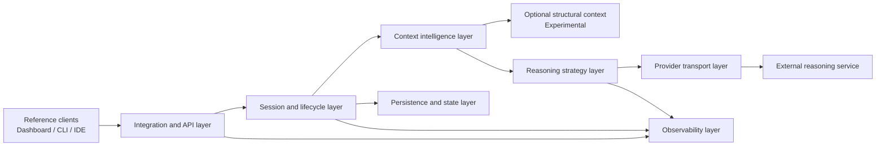

# SC-EVM Canonical Architecture

> **Governance:** This is the authoritative description of the implemented technical architecture. Changes require architecture review. It distinguishes implemented, experimental, unsupported, and proposed behavior and conforms to the [Product Manifesto](MANIFESTO.md), [Product Boundary](PRODUCT_BOUNDARY.md), and [RFC process](rfcs/README.md).

## 1. System Purpose

SC-EVM is a session-isolated context-control layer for multi-turn AI applications. Its runtime bounds direct conversation history, retrieves selected session-owned context, treats retrieved material as untrusted reference data, invokes a configured reasoning strategy, and provides explicit lifecycle controls. The complete repository also contains optional clients, developer tooling, durable auxiliary state, evaluation infrastructure, and experimental structural context; these do not redefine the core product.

## 2. Architectural Principles

The architecture applies the four product pillars as technical constraints:

- **Relevance:** only admitted context should influence the current turn.
- **Isolation:** session-owned state is scoped, locked, expired, and burnable independently.
- **Control:** lifecycle, action, configuration, and failure behavior are explicit at boundaries.
- **Evidence:** claims remain separate from mechanisms and are backed by repeatable tests or artifacts.

Implemented behavior is canonical only where source and tests support it. Intended behavior is labeled as a proposal. Experimental behavior is optional and may degrade without breaking the MVP path. Unsupported claims are listed explicitly.

## 3. Canonical Component Map

The arrows show allowed runtime dependency direction. Reference clients do not own server session state. Provider transport does not own session state. Graphify is a parallel optional input to context assembly, not a required dependency.

## 4. Repository-Wide Subsystem Inventory

Each subsystem has exactly one runtime-status classification: **Active Core**, **Active Optional**, **Experimental**, **Deprecated**, **Stubbed**, or **Documentation Only**.

| Subsystem | Purpose | Main files | Runtime responsibility | Inputs | Outputs | State owned | Dependencies | Failure behavior | Status |
|---|---|---|---|---|---|---|---|---|---|
| HTTP/SSE API | Network integration and session lifecycle | `src/main.py` | Validates request shapes, selects sessions, coordinates turns, emits events | HTTP JSON | JSON envelopes and SSE events | Orchestrator singleton only | Session registry, context engine, strategy | Structured errors; turn emits error event | Active Core |
| Session registry and locks | Session identity, isolation, capacity, TTL, burn | `src/memory.py` | Creates, guards, expires, and removes session records | Session ID, lifecycle calls | Session records, manifests | Session map, locks, GC task | Missing session returns none/404 path; integrity mismatch fails closed | Active Core |
| Session runtime helpers | Snapshot, embedding, indexing, task tracking | `src/services/session_runtime.py` | Bridges session state to retrieval and background ingestion | Session record, text | Snapshot, vectors, indexed turns | Background task set | Index error logged; burn race aborts on missing collection | Active Core |
| Context intelligence engine | Reformulation, retrieval admission, context fusion, phase gate | `src/sc_evm.py` | Produces grounded intent and admitted context | Prompt, history, query vector, collection | Search query, grounded prompt, protected context | None beyond collaborators | Reformulation falls back to raw input; retrieval failure yields no context | Active Core |
| Prompt and parsing services | Stable prompt construction and response cleanup | `src/services/prompt_manager.py`, `src/services/response_parsing.py` | Builds control messages and strips fences | Context, history, responses | Provider prompts and clean text | Static templates | Callers apply raw-input or schema fallback | Active Core |
| Reasoning orchestrator | Parallel candidate generation, synthesis, structured result | `src/agent.py` | Calls two model keys, synthesizes text/intent/action/memory | Memory snapshot, augmented prompt | `RefinedResponse` | Model-key selection | Model connector, prompt manager | One failed candidate is labeled; synthesis failure returns best available response | Active Optional |
| Single-model strategy | One-call comparison/reference reasoning path | `src/strategies/single_model_adapter.py` | Runs structured turns with bounded local history | Prompt, benchmark session ID | Strategy result | In-process benchmark session map | Model connector | Provider/schema failures surface to runner | Active Optional |
| Dual-model strategy adapter | Benchmarks the live API behavior | `src/strategies/dual_model_adapter.py` | Consumes API SSE into one strategy result | Prompt, session ID | Text, action, usage estimates, latency | HTTP client | Live API | HTTP/SSE errors fail the turn | Active Optional |
| External CLI adapter | Comparison path for an installed CLI | `src/strategies/antigravity_cli_adapter.py` | Runs an external command and normalizes output | Prompt, session ID, environment | Strategy result | None | External executable | Nonzero exit or empty output marks failure | Experimental |
| Provider connector contract | Provider-facing service boundary | `src/services/model_connector.py` | Delegates sync/async calls | Model key, prompt, controls | Text or async stream | Transport instance | NVIDIA client | Transport exceptions propagate | Active Core |
| NVIDIA NIM transport | Current external reasoning transport | `src/clients.py` | Auth, payload mapping, pooling, retries, optional stream parsing | Model key, credentials, messages | Text or token iterator | Shared HTTP client and background loop | Retries selected network/status failures; final error propagates | Active Core |
| Local embedding function | Produces query and document vectors | `src/memory.py`, `src/services/session_runtime.py` | Embeds text locally for session retrieval | Text | Numeric vector | Model cache managed by dependency | Chroma embedding function | Calibration falls back; turn retrieval logs failures | Active Core |
| Graphify bridge | Optional structural code context | `src/graphify_bridge.py`, `src/sc_evm.py` | Queries dependencies/usages in parallel with semantic retrieval | Reformulated query/entity text | Structural context text | None | Graphify CLI and generated graph | Missing CLI, timeout, or command error returns empty context | Experimental |
| Persistent learned-fact manager | Optional durable profile/facts for daemon path | `src/memory.py` | Loads, deduplicates, locks, and writes local JSON | Facts/profile changes | Long-term context | `~/.assistant_memory.json` and lock | Local filesystem, file lock | Load keeps defaults; failed/locked write is logged and skipped | Active Optional |
| Telemetry sink | Local interaction/error audit | `src/telemetry_sink.py` | Appends JSON lines | Session interactions and errors | Local audit entries | Configured audit file | Local filesystem | Logging failure is caught by callers where integrated | Active Optional |
| React dashboard | Reference web control plane | `engine-dashboard/` | Chat, session operations, memory display, charts | Browser input, API/SSE | UI | Browser state | Backend API | UI shows request errors; latency/session/intent state is measured, while token efficiency remains heuristic | Active Optional |
| Terminal client | Reference interactive client and action approval | `src/cli.py` | Session setup, SSE rendering, history/memory, burn, action prompts | Terminal input | Terminal output and approved local actions | Client session ID | Backend API | Network errors are reported to user | Active Optional |
| Diff/action engine | Validates, previews, and applies file edits | `src/apply_diff_engine.py` | Enforces edit contract and tracks previews | Structured edit payload | Preview or changed file | Preview registry/files | Local filesystem | Invalid contract/path fails explicitly | Active Optional |
| Secure lifecycle manager | Coordinates burn and preview cleanup | `src/secure_lifecycle_manager.py` | Calls burn and removes registered temporary previews | API URL, session ID | Cleanup result | Preview registry reset | Backend and filesystem | Local cleanup continues if backend is unavailable | Active Optional |
| VS Code context provider | Local workspace scan and code-context index | `src/vscode_context_provider.py` | Chunks, indexes, updates, and queries workspace files | File paths/content | Relevant code snippets | Local Chroma persistence path | Filesystem, Chroma | Skips binary/unreadable files; errors reported | Active Optional |
| Session rehydration hook | Restores session history/editor context | `src/session_rehydration_hook.py` | Retries backend and queues unavailable hydration | History source, active file | API messages or queued record | Local SQLite queue | Backend, filesystem | Exponential retry then durable queue | Active Optional |
| Clipboard service and GUI | Local encrypted clipboard workflow | `src/clipboard_service.py`, `src/clipboard_gui.py`, `src/daemon.py` | Captures clips, displays GUI, accepts local IPC | Clipboard events, socket requests | Clipboard entries and agent responses | Encrypted in-process history, local config | OS clipboard, GUI, UNIX socket | Platform/IPC failures are logged and isolated | Active Optional |
| Clipboard synchronization | Intended cross-device relay seam | `src/sync.py` | Derives key and simulates push/pull | Secret and clipboard text | Status only | Salt/config and in-process cipher | Missing external relay | Reports BYOB not configured; no real synchronization | Stubbed |
| Image generation action | Placeholder action branch | `src/agent.py` | Returns a path without generating content | Prompt, filename | Local path | None | None | Always behaves as a stub | Stubbed |
| Benchmark and evidence runners | Repeatable strategy execution, evaluation, statistics, and immutable artifacts | `src/benchmarks/`, `src/evidence/`, `evaluation/` | Runs strategies and records raw outputs, evaluator results, failures, latency, usage, statistics, and certification | Governed workload, strategies, optional live services | JSON artifacts and reports | Generated immutable run directories | Backend/provider/CLI | Per-turn failures and missing evidence are retained; claim certification remains gated | Active Optional |
| Tests and stress harnesses | Validate isolation, lifecycle, endpoints, context, tooling | `src/tests/` | Unit, integration, stress, and live checks | Code and optional live services | Test results/reports | Generated test reports | Runtime and optional backend | Failures are explicit; live tests require services | Active Optional |
| Container packaging | Evaluation/development deployment | `Dockerfile.*`, `docker-compose.yml` | Builds API and dashboard containers | Source, env file | Running containers | Container-local plus mounted files | Docker, external provider | Restart policy; no production orchestration guarantees | Active Optional |
| Governance and architecture records | Control product/architecture decisions | `MANIFESTO.md`, `PRODUCT_BOUNDARY.md`, `ARCHITECTURE.md`, `rfcs/`, `architecture/` | Define authority, decisions, gaps, and validation expectations | Reviews and evidence | Controlled documents | Git history | Repository process | No runtime effect | Documentation Only |
| Legacy HTML and VS Code bridge | Superseded entry paths | deleted `src/index.html`, deleted `src/vscode_bridge.py` | None in current checkout | None | None | None | None | Not available | Deprecated |

## 5. Canonical Component Layers

No separate layer is created for a single implementation convenience. These nine layers correspond to actual responsibilities.

| Layer | Responsibility | Owned state | Allowed dependencies | Prohibited dependencies | Failure isolation | MVP |
|---|---|---|---|---|---|---|
| Integration/API | Validate network contracts and expose lifecycle/query results | Orchestrator singleton | Session, context, strategy, observability | Direct ownership of provider credentials or persistence files | Converts boundary failures into HTTP/SSE errors | Yes |
| Session and Lifecycle | Own session identity, locks, TTL, capacity, integrity, burn | Session registry, records, locks, GC | Persistence/state and observability | Provider-specific request logic | Session-scoped locks and independent records | Yes |
| Context Intelligence | Realign intent, retrieve, admit, and protect context | No durable state | Session snapshot, local embedding, optional structural context, provider connector for reformulation | Client UI or durable profile ownership | Falls back to raw intent or empty retrieved context | Yes |
| Reasoning Strategy | Transform protected context into a response contract | Strategy-local comparison state | Provider transport, prompt/parsing services | Session registry mutation except through returned contract | Candidate and synthesis fallbacks | One strategy required; dual-model optional |
| Provider Transport | Normalize external reasoning calls | HTTP pool, transport loop | Configuration and external service | Session, retention, burn, or action ownership | Retry/timeout boundary; final errors propagate | Yes, current transport only |
| Persistence and State | Store ephemeral session and optional auxiliary state | See persistence matrix | Filesystem and storage dependencies | Product policy decisions | State-specific locks and lifecycle behavior | Ephemeral session subset only |
| Optional Structural Context | Supply code-relationship context | Generated artifacts outside runtime process | Graphify CLI/artifacts | Required control of semantic retrieval | Empty-result fallback | No |
| Observability | Record errors, interactions, and evaluation results | Audit and generated result files | Callers and filesystem | Control of request outcome | Logging/report failures do not redefine session state | Configuration/error boundary yes; full tooling no |
| Reference Client | Demonstrate and operate public contracts | Browser/terminal/IDE/clipboard local state | Integration/API | Server session-state ownership | Client failures remain outside server core | No |

## 6. Mandatory, Optional, Experimental, and Deprecated Components

### Mandatory runtime

The API path requires configuration, the integration layer, session/lifecycle services, context intelligence, local embedding and semantic retrieval, one reasoning strategy, one provider transport, prompt/response services, and structured error handling.

### Optional runtime

The dashboard, terminal client, IDE integration, rehydration, lifecycle helper, clipboard workflow, persistent learned facts, telemetry file, action engine, dual-model strategy, benchmark runner, and containers can be omitted without changing the core product definition.

### Experimental runtime

Graphify structural context and the external CLI strategy are experimental. They must remain removable and must not become implicit MVP dependencies.

### Stubbed and deprecated

Image generation and clipboard synchronization are stubbed. Deleted legacy HTML and VS Code bridge paths are deprecated. None may be presented as an active product capability.

## 7. Canonical Request Lifecycle

The live `/api/agent/query` path behaves as follows:

1. The client submits `session_id` and `prompt`.
2. The API enters a session operation with `create=True`; an unknown valid
   session ID is therefore initialized implicitly on this route.
3. The API obtains the per-session lock to read recent history, pending memory, threshold, and a memory snapshot.
4. The context engine sends bounded recent history and current input through intent realignment.
5. Empty or invalid reformulation falls back to the original input.
6. The session-local embedding function creates a query vector.
7. Semantic retrieval queries at most three documents filtered by `session_id`.
8. Graphify retrieval may run concurrently when the CLI is available.
9. Confidence gating admits or rejects semantic documents.
10. Graphify output and admitted semantic documents are enclosed separately as reference context.
11. Pending, not-yet-indexed memory is appended in its own untrusted enclosure.
12. The protected context and grounded prompt are passed to the reasoning strategy.
13. The current orchestrator obtains two candidate responses and requests one structured synthesis response.
14. Parsed remembered facts are deduplicated into session metadata.
15. Proposed actions are checked against the configured development phase; blocked actions become `none`.
16. The API emits the complete answer in one `response_content` SSE event. A
    degraded candidate or synthesis path also emits an explicit `degradation`
    event, followed by action, stage-labeled usage or failure records, legacy
    usage estimates, and intent.
17. The API appends user and assistant messages under the session lock and trims direct history to six messages.
18. A tracked background task embeds and adds the completed interaction to the session collection.
19. The stream emits `done`; failures emit an error event and are logged.

Provider-native streaming exists in the transport implementation but is not
wired into the canonical API reasoning path. The API stages one complete
answer event after provider responses and synthesis are complete, so time to
first answer content is approximately full-turn latency.

## 8. Context Lifecycle

1. Recent direct history remains bounded to the configured six-message window in the API path.
2. Intent realignment produces separate retrieval and grounded-reasoning text.
3. Semantic candidates are scoped by session metadata and admitted through explicit confidence rules.
4. Optional structural context is collected independently and labeled separately.
5. Pending memory closes the interval between response completion and background indexing.
6. Retrieved and pending context is treated as untrusted reference data, not control instructions.
7. The reasoning result may propose learned facts; the web path stores them in session metadata, while the daemon path can persist them separately.

## 9. Memory and Persistence Model

Persistence classifications are exactly: **Ephemeral**, **Durable**, **Optional Durable**, **Generated Artifact**, **External State**, and **Stubbed**.

Core web session context is ephemeral. Optional and auxiliary subsystems persist local state. The complete repository is not universally stateless.

| State | Owner | Medium | Scope | Lifetime | Persistence | Burn | TTL | Cross-process safety | Backup | Sensitivity | Product classification |
|---|---|---|---|---|---|---|---|---|---|---|---|
| Session vector memory | SessionRecord | In-process ephemeral collection | Session | Session/TTL/process | Ephemeral | Collection deletion attempted | Yes | No shared-process coordination | None | Conversation content | Core Product |
| Bounded recent history | SessionRecord | In-process list | Session | Session/TTL/process | Ephemeral | Record removed | Yes | No | None | Conversation content | Core Product |
| Pending commit buffer | Session metadata | In-process list | Session | Until indexing/record removal | Ephemeral | Record removed | Yes | No | None | Recent conversation | Core Architecture |
| State manifest | SessionRecord | In-process object/checksum | Session | Session/TTL/process | Ephemeral | Record removed | Yes | No | None | Integrity metadata | Core Architecture |
| Session metadata | SessionRecord | In-process dictionary | Session | Session/TTL/process | Ephemeral | Record removed | Yes | No | None | Phase, facts, thresholds | Core Architecture |
| Persistent learned facts/profile | MemoryManager | Locked JSON file | Local user/daemon | Until file deletion | Optional Durable | Not removed by web session burn | No | File lock protects cooperating writers; last-write semantics remain | User-managed only | Personal data | Experimental |
| Telemetry/audit log | Telemetry sink | JSON-lines local file | Local deployment | Until external deletion | Durable | Not removed by session burn | No | Append behavior lacks centralized multi-process governance | User-managed only | Prompts, responses, errors | Supporting Infrastructure |
| Graphify artifacts/cache | Graphify tool | Repository/local generated files | Repository snapshot | Until regenerated/deleted | Generated Artifact | Unaffected | No | Tool-managed | Git or external copy | Source structure | Experimental |
| Benchmark results | Benchmark runner | JSON files | Run/strategy | Until deleted | Generated Artifact | Benchmark session is burned; files remain | No | Unique timestamps reduce collisions | Git or external copy | Prompts and response excerpts | Supporting Infrastructure |
| IDE code index | WorkspaceScanner | Local Chroma path | Workspace | Until rebuilt/deleted | Optional Durable | Unaffected by session burn | No | No documented multi-process coordination | None by default | Source code | Supporting Infrastructure |
| Rehydration queue | Rehydration hook | SQLite file | Local tool | Until replay/cleanup | Optional Durable | Unaffected | No | SQLite transaction safety | None by default | Conversation/editor context | Supporting Infrastructure |
| Clipboard history | Clipboard service | Encrypted in-process entries; local config salt | Local user | Process/config lifetime | Optional Durable | Unaffected by web burn | No | Process-local history | None by default | Clipboard secrets | Experimental |
| Preview/action files | Diff/lifecycle tooling | Local filesystem and registry | Local user/workspace | Until apply/purge/manual deletion | Optional Durable | Separate lifecycle manager purges registered previews | No | No global coordination | User-managed | Source code/actions | Supporting Infrastructure |
| Configuration | Settings | Environment and `.env` | Process/deployment | Deployment lifetime | External State | Unaffected | No | Deployment-managed | Operator-managed | Operational values | Supporting Infrastructure |
| Secrets | Settings/provider transport | Environment or mounted `.env` | Process/deployment | Credential lifetime | External State | Unaffected | No | Deployment-managed | Secret-manager responsibility | Credentials | Supporting Infrastructure |
| Clipboard relay state | SyncService | No implemented relay | Intended device scope | Not implemented | Stubbed | Not defined | Not defined | Not defined | None | Clipboard content | Experimental |

## 10. Background Task Lifecycle

- Interaction indexing is scheduled only after response/history mutation.
- Tasks are retained in a process-level set so shutdown can await them.
- Completion callbacks remove finished tasks from the set.
- If burn deletes the collection before indexing completes, the missing-collection error is recognized and indexing exits without reinitializing the session.
- Other indexing failures are logged and do not roll back the delivered response.
- The TTL collector is started during application lifespan and periodically calls the same burn path for stale sessions.
- The collector task is not explicitly cancelled on shutdown; process shutdown ends it after pending indexing is awaited.

## 11. Session Burn Lifecycle

1. The API or lifecycle tool requests burn for one session ID.
2. The registry obtains the session-specific lock.
3. The record is removed from the registry.
4. Deletion of the session's ephemeral collection is attempted.
5. The session lock entry is removed.
6. Later background indexing sees a missing collection and exits without creating a replacement.

Burn removes application-level access to session-owned ephemeral state. It does not guarantee physical RAM destruction and does not delete audit logs, persistent learned facts, IDE indexes, Graphify artifacts, benchmark files, clipboard data, or unregistered local files.

## 12. Startup and Shutdown Lifecycle

At startup, the API checks only for local presence of a configured NVIDIA key; it does not perform a network health check. It starts the session TTL collector. The reasoning orchestrator remains lazy and authenticates when first constructed.

At shutdown, the TTL collector is explicitly cancelled and awaited, tracked
indexing tasks are awaited, and the shared provider HTTP client is closed. No
durable migration or session snapshot occurs. Ephemeral sessions disappear
with the process.

## 13. Failure and Degradation Behavior

| Failure | Behavior | Customer-visible effect |
|---|---|---|
| Unknown session on query | Request fails before reasoning | Error response/stream |
| Reformulation provider/schema failure | Raw prompt used for search and reasoning | Lower contextual precision possible |
| Local embedding or semantic retrieval failure | Error logged, context may be empty | Reasoning continues with less memory |
| Graphify unavailable/timeout/error | Empty structural context | Semantic path continues |
| One reasoning candidate fails | Failure marker passed to synthesis | Remaining candidate may supply response |
| Synthesis/schema failure | Best available candidate returned with no action | Reduced structure, response still possible |
| Phase policy rejects action | Action replaced with `none` and response annotated | No automated action |
| Background indexing failure | Logged; response remains delivered | Turn may be absent from later retrieval |
| Manifest mismatch | Error logged and request fails closed | Session unavailable until repaired/burned |
| Persistent fact write lock/error | Write skipped and logged | Durable personalization update lost |
| Audit write failure | No central recovery guarantee | Observability gap |
| Provider exhaustion/timeout | Error propagates to API/runner | Turn failure |

## 14. Provider Abstraction

The canonical boundary is `ModelConnector`: callers supply a logical model key, prompt/messages, system control, token limit, and sync/async intent; the connector delegates transport-specific behavior and returns text or an async iterator.

| Concern | Current path | Classification |
|---|---|---|
| Provider connector interface | `src/services/model_connector.py` delegates to one transport | Implemented |
| NVIDIA NIM chat-completions transport | OpenAI-compatible endpoint in `src/clients.py` | Implemented |
| Model 1 selection | Configurable logical key/aliases, physical `MODEL_1_FLASH`, generation parameters, and pricing | Implemented |
| Model 2 selection | Configurable logical key/aliases, physical `MODEL_2_CORE`, generation parameters, and pricing | Implemented |
| Local embedding provider | ONNX MiniLM through Chroma dependency | Implemented |
| Reformulation provider | Configured Model 1 role | Implemented, NVIDIA-specific |
| Candidate reasoning providers | Configured Model 1 and Model 2 roles | Implemented, NVIDIA-specific |
| Synthesis provider | Configured Model 2 role | Implemented, NVIDIA-specific |
| Provider-native stream parsing | NVIDIA transport supports it | Implemented but unused by canonical API path |
| Provider-neutral error/usage contract | Exceptions and text only; no normalized usage/error taxonomy | Partially Implemented |
| Additional external provider adapters | None in current repository | Planned through reserved RFC-0004, not implemented |
| Vertex AI/Google AI/Anthropic direct runtime | Removed; compatibility aliases resolve only to configured NVIDIA NIM routes | Unsupported |

Retries cover HTTP/network failures and selected retryable status codes with exponential backoff and optional `Retry-After`; configured maximum retries default to three. Connect, read, write, and pool timeouts are defined in the transport. Structured output is enforced by prompts and parsing rather than a provider-independent schema capability.

SC-EVM is provider-adaptable at the reasoning boundary, not provider-independent in current implementation. Session ownership and burn semantics must remain outside any future adapter. A broader contract requires RFC-0004; it is not implemented by this document.

## 15. Graphify Placement

Graphify is an **optional, experimental structural-context capability outside the MVP and not yet commercially validated**.

- **Invocation:** `SCEVMEngine.evaluate_query_context` checks for the `graphify` executable and runs `get_structural_context` in parallel with semantic retrieval.
- **Input:** the reformulated search text is used as the queried entity/question.
- **Output:** trimmed CLI stdout or an empty string.
- **Artifacts:** Graphify requires its CLI and generated repository graph/cache artifacts.
- **Separation:** output is enclosed as `<graphify_context>`; semantic memories use separate `<retrieved_memory>` blocks.
- **Failure:** missing executable, nonzero exit, empty output, timeout, or exception produces no structural context.
- **Fallback:** semantic retrieval and reasoning continue.
- **Validated claim:** the repository contains an implemented structural query path and generated structural artifacts.
- **Unproven claims:** retrieval precision, contextual relevance, answer correctness, long-horizon retention, hallucination resistance, and token efficiency uplift.

## 16. Security and Trust Boundaries

| Boundary | Trusted input | Untrusted input | Validation/authorization/isolation | Logging exposure | Deletion semantics | Known limitation |
|---|---|---|---|---|---|---|
| External client | Server configuration | All HTTP bodies and session IDs | Pydantic shape validation; no authentication or authorization | Prompts/errors may reach audit log | Client cannot prove deletion beyond API result | Public API is unauthenticated |
| Authentication | Configured provider credentials | Client identity claims | Provider key checked locally; no application-user auth | Key values should not be logged | Credentials external to burn | Presence check is not provider health verification |
| Session identity | Registry key | Client-supplied `session_id` | Exact dictionary key and metadata filter | Session ID logged | Record/collection removed on burn | Possession of ID is not authorization; IDs are enumerable via list endpoint |
| Tenant isolation | Per-session record/collection/lock | Concurrent requests | Separate collection, metadata filter, per-session lock | Cross-session audit file may co-locate records | Logical application-level deletion | No authenticated tenant boundary or cross-process registry |
| Retrieved memory | System control instructions | Stored conversation and pending text | Admission policy and labeled enclosures | Retrieved content may be emitted in SSE diagnostic event | Removed with session state | Enclosure reduces risk but is not a proof against instruction influence |
| Provider | Local connector policy | External service responses | Response parsing and Pydantic result schema with fallback | Errors may contain provider detail | External retention governed by provider | Prompts/context leave local trust boundary |
| Local filesystem | Operator-owned paths | History sources, workspace files, config, previews | File-type/path checks vary by tool; OS permissions | Audit and generated files persist | Separate manual/tool cleanup | No unified retention or encryption policy |
| Action execution | Human approval and phase setting | Model-proposed command/file payload | Typed contract, phase gate, diff validation, CLI confirmation | Proposed actions may be displayed/logged | Preview cleanup separate from session burn | Generic actions are outside core product; policy is not a full sandbox |
| Graphify artifact | Local generated graph | Inferred or stale relationships | CLI exit/timeout checks and separate enclosure | Output can appear in retrieved-context SSE event | Unaffected by session burn | Artifact provenance/freshness does not guarantee correctness |
| Telemetry | Operator configuration | Prompts, responses, errors | Append-only local formatting; no field-level redaction | Central exposure point by design | Not deleted by session burn | Sensitive content may persist without retention policy |
| Deletion | Registry and collection ownership | Concurrent indexing and external state | Lock, record removal, collection delete, missing-collection guard | Burn logged | Removes application access to ephemeral session state | Not physical memory erasure; auxiliary durable state remains |

Security claims are bounded to implemented logical controls. Cross-session leakage is not described as mathematically impossible. The current service does not provide enterprise-grade application authentication or authorization.

## 17. Deployment Model

| Mode | Required components | State and persistence | Concurrency | Secrets/network/CORS | External dependencies | Classification and limitations |
|---|---|---|---|---|---|---|
| Local CLI | Backend plus `src/cli.py` | Server sessions ephemeral; optional local auxiliary files | Server per-session locks; one interactive client flow | NVIDIA key; localhost API | External reasoning service | Development/evaluation; not standalone without backend |
| Local backend + dashboard | API and React dev server | Ephemeral sessions; browser state; optional audit/facts | Up to configured in-process sessions; no cross-process sharing | Ports 8000/3000; configured localhost CORS | External reasoning service | Development/evaluation; no user auth |
| Docker Compose | API and nginx-served dashboard | API state lost on restart; `.env` and learned-fact JSON mounted | Single API container by definition | Published 8000/3000; mounted secrets | Docker and external reasoning | Evaluation deployment; local-file mount semantics and no auth |
| Public container | Backend image and external routing | Process-local sessions are lost on restart/reschedule; optional files require explicit volume | Multiple replicas do not share sessions | NVIDIA key, HTTPS/proxy, configured CORS required | Container platform and external reasoning | Architecture is containerizable, implementation is not production-ready for public multi-tenant use |
| IDE integration | Backend, workspace provider, optional rehydration hook | Local durable IDE index and rehydration queue plus server session | Local tool concurrency; no documented shared index coordination | Local API and filesystem access | Editor integration and backend | Optional development workflow; source privacy boundary is local/operator-managed |
| Clipboard/daemon | Daemon, GUI, clipboard service, model access | Process-local encrypted history plus local config/facts | Threads and local UNIX socket | Provider key; permissioned local socket | OS clipboard/GUI and external reasoning | Optional local workflow; platform-specific; sync relay absent |

The architecture is suitable for development and controlled evaluation. It is container-capable but not production-ready. Production capability would require authenticated tenant identity, shared or deliberately sticky state, durable-state governance, secret management, operational health checks, and validated scale/failure behavior.

## 18. Observability and Audit Behavior

- Interactions and selected errors append JSON records to a configured local audit path.
- Standard logging is used across API, session, context, provider, tooling, and lifecycle components.
- SSE exposes reformulation and retrieved-context diagnostic events to the requesting client, which may reveal sensitive recalled content.
- The live API emits typed usage records when provider usage is available and
  retains explicit estimates otherwise; its legacy `token_usage` event remains
  character-based and is not billing-grade.
- The evidence runner records raw outputs, evaluator results, failures,
  latency, usage, statistics, provenance, checksums, and certification state.
- Audit content redaction, file permissions, and size-bounded rotation are
  implemented. No metrics service, distributed trace correlation, retention
  duration, audit deletion workflow, or production alerting is implemented.
- Existing benchmark artifacts are historical evidence and are not rewritten by architecture governance.

## 19. Architecture Invariants

| Invariant | Enforcing components | Available evidence | Validation gap |
|---|---|---|---|
| Session context must not be retrieved across session boundaries | Per-session collection, `where` filter, registry locks | `test_memory_isolation.py`, concurrency/stress tests | No authenticated multi-process tenant test |
| Active direct history remains bounded | API trim loop, prompt history slice | `test_sc_evm*`, source inspection | Config constant and API/manual-message paths need unified property test |
| Retrieved memory is untrusted reference data | Prompt manager and separate enclosures | Prompt/source inspection | No adversarial prompt-injection evaluation |
| Burn removes application access to session-owned ephemeral state | Registry `flush_session`, collection delete | lifecycle, isolation, stress tests | No physical-erasure claim; concurrent external callers not exhaustively tested |
| Optional Graphify failure does not break semantic retrieval | executable check, bridge empty fallback, parallel gather behavior | source inspection | No dedicated unavailable/timeout integration test |
| Provider logic does not own session state | ModelConnector/NVIDIA client boundary | dependency inspection | Logical model keys remain embedded in strategies |
| Background indexing does not re-create a burned session | direct collection reference and missing-collection guard | session runtime source, lifecycle tests | Race coverage is limited |
| Experimental subsystems do not become MVP dependencies | optional Graphify/clients and Product Boundary | RFC-0001, dependency inspection | No automated dependency-policy check |
| Durable learned facts remain separate from ephemeral session memory | `MemoryManager` file vs SessionRecord metadata | source inspection | Web and daemon semantics differ and are not contract-tested together |
| Commercial claims require repeatable evidence | Governance documents, accepted RFC-0003, evaluators, statistics, and certification gates | `evaluation/test_evidence_platform.py`, immutable smoke artifacts | Governed live Validation/Final Evaluation campaigns and human adjudication remain incomplete |
| Declared token budgets must correspond to enforced model inputs | Session metadata, prompt builders, and provider usage records | Source inspection shows `token_budget=2500` is exposed but not consumed | No tokenizer-backed admission or per-turn budget enforcement |

Future changes that violate an invariant require a superseding RFC or must restore compliance before acceptance.

## 20. Known Limitations and Liabilities

The detailed reconciled register is
[architecture/ARCHITECTURE_GAPS.md](architecture/ARCHITECTURE_GAPS.md). The
most consequential current limits are unauthenticated session access,
process-local state for public deployment, incomplete provider neutrality,
staged rather than provider-token streaming, an exposed but unenforced token
budget, incomplete live claim certification, and auxiliary durable state
outside burn semantics.

No future proposal is implemented merely because it appears here. RFC-0003 is
the accepted benchmark methodology; RFC-0004 remains reserved for provider
abstraction.

## 21. Decisions and Governance Links

- [ADR index](architecture/README.md)
- [ADR-0001: Runtime Architecture](architecture/ADR-0001-runtime-architecture.md)
- [ADR-0002: Context and Memory Lifecycle](architecture/ADR-0002-context-and-memory-lifecycle.md)
- [ADR-0003: Provider Boundary](architecture/ADR-0003-provider-boundary.md)
- [ADR-0004: Persistence Model](architecture/ADR-0004-persistence-model.md)
- [ADR-0005: Security and Trust Boundaries](architecture/ADR-0005-security-and-trust-boundaries.md)
- [RFC-0001: Product Boundary](rfcs/RFC-0001-product-boundary.md)
- [RFC-0002: Architecture Canonicalization](rfcs/RFC-0002-architecture-canonicalization.md)
- [RFC-0003: Benchmark Methodology](rfcs/RFC-0003-benchmark-methodology.md)

These accepted records govern current behavior and evidence. Proposed provider,
token-budget, or methodology changes require their own review and must not be
inferred from this architecture.
