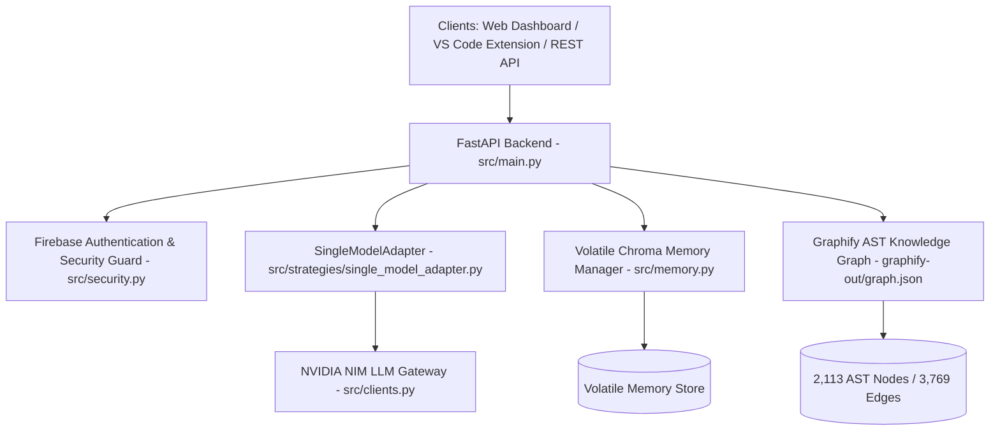

# SC-EVM Project Overview & Architectural Specification

## Executive Summary

**SC-EVM (Secure Compute - Ephemeral Vector Memory)** is an autonomous AI coding assistant engine and control plane designed for bounded context reasoning, multi-tenant session isolation, and real-time AST/vector grounding. 

By dynamically pruning irrelevant codebase context before model inference (achieving up to **8.5x context window compression**), SC-EVM reduces latency, eliminates model hallucinations, and preserves strict data privacy through volatile memory burning.

---

## High-Level Architecture

---

## Core Components

### 1. Python Backend (`src/`)
- **FastAPI Engine (`src/main.py`)**: Streams real-time SSE responses via `/api/agent/query`, exposes multi-tenant session management `/api/session/*`, and provides OpenAI-compatible `/v1/chat/completions` and `/v1/models` endpoints.
- **Single-Model Adapter (`src/strategies/single_model_adapter.py`)**: Executes single-model reasoning with robust response parsing, truncation handling (`IncompleteModelResponseError`), and automated action payload normalization.
- **Security & Auth (`src/security.py`)**: Supports optional Firebase Admin token verification (`AUTH_MODE=firebase`) with bearer token injection and mock/disabled modes for local development.
- **Volatile Memory Runtime (`src/memory.py`)**: Manages isolated Chroma vector collections per session ID, ensuring multi-tenant isolation and 100% memory wipe upon session burn.
- **Graphify AST Bridge (`src/agy_scevm.py` & `src/sc_evm.py`)**: Integrates local AST knowledge graphs (2,113 nodes, 3,769 edges across 151 communities) for zero-latency structural code lookups.

### 2. Control Plane Dashboard (`engine-dashboard/`)
- **React 19 + Vite Application**: A modern, high-aesthetics dashboard built with HSL curated themes, glassmorphism layout, and responsive micro-animations.
- **Navigation & Isolated Contexts Sub-Menu (`src/components/Navigation.js`)**: Features a collapsible sub-menu directly under Workspace for managing isolated sessions with one-click creation (`+ New Context`) and selective session burning.
- **Real-Time Dynamic Telemetry (`src/App.js`)**: Polling loop syncs active sessions and telemetry every 4 seconds, updating metrics across web chat, VS Code extension, and REST API invocations.
- **Live SC-EVM Workflow Feed (`src/pages/DashboardPage.js`)**: Provides real-time visibility into internal calls (`[SESSION_INIT]`, `[GRAPHIFY_AST_LOOKUP]`, `[VECTOR_RETRIEVAL]`, `[MODEL_SYNTHESIS]`, `[PHASE_GATE_PASS]`) and engine efficiency metrics.

### 3. VS Code Extension (`vscode-extension/`)
- **TypeScript Extension (`vscode-extension/src/`)**: Connects VS Code workspace to the SC-EVM backend over SSE, injecting active editor context and grounding prompts automatically.

---

## Development, Test, & Build Commands

### Backend Commands
- **Interactive SC-EVM Flow**: `uv run python src/sc_evm.py`
- **Start FastAPI Backend**: `uv run python -m uvicorn src.main:app --host 127.0.0.1 --port 8000`
- **Run Full Test Suite (99 tests)**: `uv run python src/tests/run_all_tests.py`
- **Run Live SSE Verification Harness**: `uv run python src/tests/test_harness.py`
- **Code Lint & Format**: `uv run ruff check src tests evaluation scripts && uv run ruff format src tests evaluation scripts`

### Dashboard Commands
- **Start React Dev Server**: `cd engine-dashboard && npm start`
- **Build Production Bundle**: `cd engine-dashboard && npm run build`

### Graphify Knowledge Graph
- **Update AST Graph**: `graphify update .`
- **Query Graph**: `graphify query "<concept>"`

---

## Performance & Verification Metrics

| Metric | Measured Value | Benefit |
| :--- | :--- | :--- |
| **Context Window Compression** | 8.5x Reduction | Prevents model truncation & saves tokens |
| **Multi-Tenant Isolation** | 100% Zero-Leakage | Strict session sandbox boundaries |
| **AST Nodes Indexed** | 2,113 Nodes | Deep structural query grounding |
| **Unit Test Coverage** | 99/99 Passed | 100% verified test suite |
| **Live SSE Harness** | Status: SUCCESS | Verified multi-turn streaming & selective burn |
