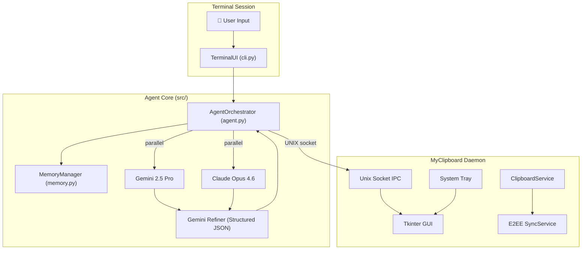
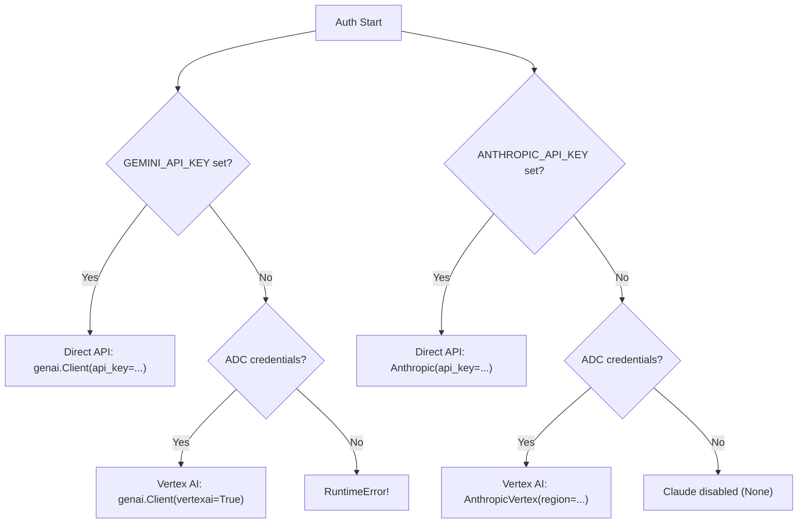
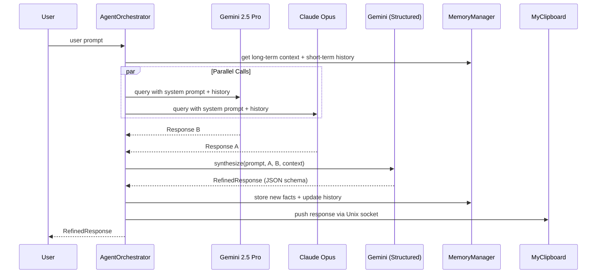
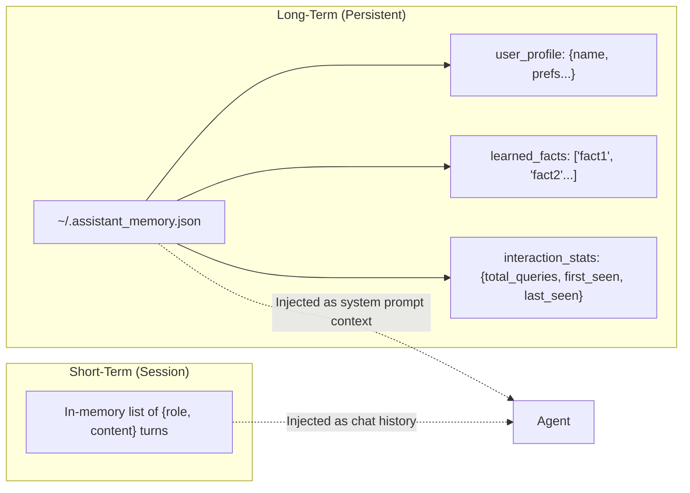
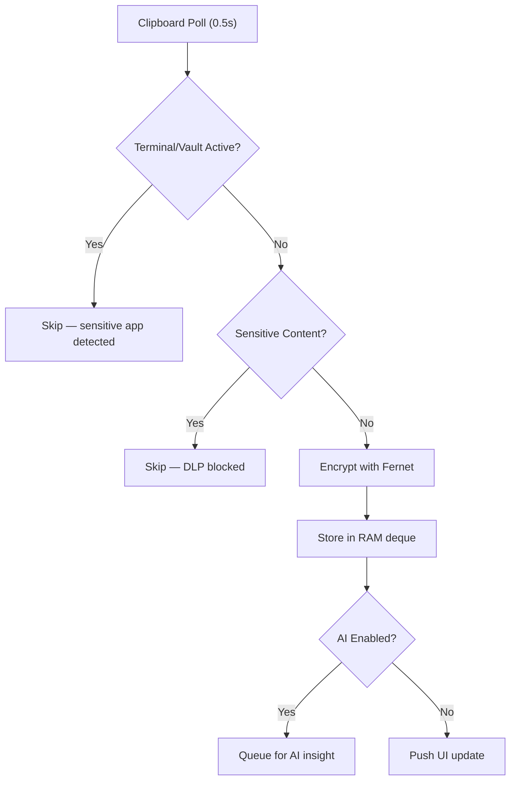

# Anthropic-VertexAI-Agent — Full Project Walkthrough

This project is a **Dual-LLM Personal Assistant** that queries both **Google Gemini** and **Anthropic Claude** in parallel, synthesizes their responses into a single refined answer, and integrates with an **enterprise-grade clipboard manager** (MyClipboard). Everything runs locally from your terminal.

---

## High-Level Architecture



---

## Project Structure

```
Anthropic-VertexAI-Agent/
├── pyproject.toml            # Python project config (hatchling build)
├── README.md                 # Brief project description
├── uv.lock                   # Locked dependency graph (uv package manager)
├── .venv/                    # Virtual environment
│
├── src/                      # ── CORE ASSISTANT ──
│   ├── main.py               # Entry point, boots everything
│   ├── agent.py              # Dual-LLM orchestrator + synthesis + image gen
│   ├── cli.py                # Rich terminal UI with custom spinner
│   └── memory.py             # Dual-memory system (short-term + persistent)
│
└── MyClipboard/              # ── COMPANION CLIPBOARD MANAGER ──
    ├── mcb.py                # CLI tool to pipe text into the daemon
    ├── app/
    │   ├── __init__.py
    │   ├── main.py           # Tkinter GUI + IPC listener + system tray
    │   ├── service.py        # Clipboard observer, encryption, DLP, AI transforms
    │   └── sync.py           # E2EE cross-device sync service
    ├── build.sh / install.sh # Packaging & installation scripts
    ├── myclipboard.service   # systemd unit file
    └── ...
```

---

## Module-by-Module Breakdown

### 1. Entry Point — [main.py](file:///home/rg/Codebase/Anthropic-VertexAI-Agent/src/main.py)

The `main()` function orchestrates the startup sequence:

| Step | What happens |
|------|-------------|
| 1 | Parse CLI args (`--test-mode`, `--memory-file`) |
| 2 | Register signal handlers & `atexit` cleanup |
| 3 | Initialize `MemoryManager` (loads persistent memory from `~/.assistant_memory.json`) |
| 4 | Initialize `AgentOrchestrator` (authenticates with Gemini & Claude) |
| 5 | Check/start MyClipboard daemon via Unix socket probe |
| 6 | Send `SHOW` command to bring clipboard UI to foreground |
| 7 | Launch `TerminalUI.run_interactive_loop()` |

> [!TIP]
> The `--test-mode` flag runs a single automated query (`"What is the capital of France?"`) and exits — useful for CI/CD validation.

The clipboard daemon lifecycle is managed carefully: `check_and_start_clipboard_daemon()` probes the Unix socket, and `shutdown_clipboard_daemon()` (registered via `atexit`) sends a `QUIT` command with a process-kill fallback.

---

### 2. Agent Orchestrator — [agent.py](file:///home/rg/Codebase/Anthropic-VertexAI-Agent/src/agent.py)

This is the brain of the system. It implements a **dual-LLM query + synthesis** pattern.

#### Authentication Strategy ([authenticate](file:///home/rg/Codebase/Anthropic-VertexAI-Agent/src/agent.py#L48-L91))

The auth logic is **flexible with two tiers**:



- **Tier 1 (API Keys)**: Uses `GEMINI_API_KEY` / `ANTHROPIC_API_KEY` env vars for direct API access — no GCP needed.
- **Tier 2 (Vertex AI)**: Falls back to Google Application Default Credentials (ADC) for Vertex AI.
- When using a direct Anthropic API key, the code auto-remaps Vertex-style model names (e.g. `claude-opus-4-6`) to standard Anthropic names (e.g. `claude-3-opus-20240229`).

#### The Dual-LLM Pipeline ([generate_response](file:///home/rg/Codebase/Anthropic-VertexAI-Agent/src/agent.py#L139-L191))



Key design decisions:
- **Parallel execution** via `concurrent.futures.ThreadPoolExecutor(max_workers=2)` — both LLMs are queried simultaneously.
- **Graceful degradation** — if Claude fails, the system continues with Gemini only; if synthesis fails, it falls back to the raw Gemini response.

#### Structured Synthesis ([synthesize_responses](file:///home/rg/Codebase/Anthropic-VertexAI-Agent/src/agent.py#L207-L271))

The refiner uses **Gemini's structured JSON output mode** with a Pydantic schema:

```python
class RefinedResponse(BaseModel):
    text: str          # The synthesized response text
    intent: str        # Detected intent (chat, command, image_generation, file, help, exit)
    action: Action     # Automated action to execute
    remember: List[str] # New facts to store in long-term memory
```

The `Action` model supports:
| Action Type | Payload Fields | What It Does |
|---|---|---|
| `none` | — | No side-effect |
| `run_command` | `command` | Executes a shell command (with user confirmation) |
| `generate_image` | `prompt` | Calls Imagen 3 to generate an image |
| `save_file` | `file_path`, `file_content` | Writes a file to disk |
| `update_memory` | — | Updates user profile/preferences |

#### Image Generation ([generate_image](file:///home/rg/Codebase/Anthropic-VertexAI-Agent/src/agent.py#L273-L313))

Two-tier image generation:
1. **Primary**: Google Imagen 3 (`imagen-3.0-generate-002`) via `generate_images()` API
2. **Fallback**: Gemini 3 Pro Image Preview multimodal output

---

### 3. Terminal UI — [cli.py](file:///home/rg/Codebase/Anthropic-VertexAI-Agent/src/cli.py)

Built with the **Rich** library for a polished terminal experience.

#### Features

- **Custom ASCII art header** with "Super Me!" branding
- **Custom spinner** ([super_me](file:///home/rg/Codebase/Anthropic-VertexAI-Agent/src/cli.py#L12-L35)) — a Mario/Dino 🦖🍄 animation during LLM processing
- **Built-in commands**: `exit`, `clear`, `memory`, `history`
- **Clipboard integration via `/clip` command**:
  - `/clip` — shows recent clipboard history in a table
  - `/clip <index>` — prompts for a question about that clip
  - `/clip <index> <question>` — directly asks about the clipboard content
- **Auto-clipboard injection** — if the user mentions "clipboard", "copied", etc., the system clipboard content is automatically appended to the prompt
- **Action handling** with user confirmation — commands, image gen, and file writes all require explicit approval

#### Response Display

Responses are rendered in a Rich `Panel` with Markdown formatting, tagged with the detected intent. Learned facts are displayed below the response.

---

### 4. Memory System — [memory.py](file:///home/rg/Codebase/Anthropic-VertexAI-Agent/src/memory.py)

A **dual-memory architecture**:



| Feature | Short-Term | Long-Term |
|---------|-----------|-----------|
| Persistence | Session only | JSON file on disk |
| Content | Conversation turns | User profile + facts + stats |
| Deduplication | None | Case-insensitive fact dedup |
| Injection | Chat history for models | System prompt context block |

The [get_long_term_context](file:///home/rg/Codebase/Anthropic-VertexAI-Agent/src/memory.py#L111-L127) method serializes the profile and facts into a text block that gets prepended to every LLM system prompt, giving the assistant persistent personality memory across sessions.

---

## MyClipboard — The Companion App

### Overview

MyClipboard is a **standalone enterprise clipboard manager** embedded as a sub-project. It runs as a background daemon with a Tkinter GUI, system tray icon, and global hotkeys.

### GUI Application — [app/main.py](file:///home/rg/Codebase/Anthropic-VertexAI-Agent/MyClipboard/app/main.py)

**4 tabs** in the Tkinter notebook:

| Tab | Purpose |
|-----|---------|
| `[HISTORY]` | Encrypted clipboard history with search, double-click to restore, right-click context menu |
| `[TEMPLATES]` | Pre-defined text snippets (weekly updates, meeting links, etc.) |
| `[SETTINGS]` | AI toggle, Gemini API key (stored via `keyring`), configurable hotkeys |
| `[SYNC]` | E2EE sync toggle, secret key input, connection status |

**Key features**:
- **Ghost mode** — window starts withdrawn, summoned by hotkey (`Ctrl+Alt+C`)
- **System tray** via `pystray` with pause/resume, AI toggle, and quit options
- **Global hotkeys** via `pynput` (configurable in settings)
- **Thread-safe UI updates** — clipboard changes flow through a `queue.Queue` and Tkinter virtual events (`<<NewClip>>`)

### IPC Protocol — Unix Socket (`/tmp/myclipboard.sock`)

| Command | Direction | Purpose |
|---------|-----------|---------|
| `SHOW` | Agent → Clipboard | Bring window to foreground |
| `QUIT` / `SHUTDOWN` | Agent → Clipboard | Clean shutdown |
| `ADD:<text>` | Agent/CLI → Clipboard | Add text to history |
| `ADD:AGENT_RESPONSE:<text>` | Agent → Clipboard | Add AI response (tagged with 🤖) |
| `GET_HISTORY` | Agent → Clipboard | Returns JSON array of last 5 clips |

### Clipboard Service — [app/service.py](file:///home/rg/Codebase/Anthropic-VertexAI-Agent/MyClipboard/app/service.py)

The service layer implements the core security and intelligence features:

#### Security Model



- **In-memory only** — history is never written to disk; Fernet key is ephemeral per session
- **DLP patterns** — regex detection for AWS keys, SSH private keys, JWTs, kubeconfig certs, credit cards
- **Entropy filter** — high-entropy strings without spaces (likely tokens/passwords) are blocked
- **Terminal awareness** — pauses recording when sensitive apps are in the foreground (Terminal, iTerm, SSH, KeePass, 1Password, etc.)
- **Cross-platform window detection** — cascading fallbacks: GNOME Wayland (`gdbus`) → KDE Wayland (`qdbus`) → X11 (`xdotool`) → `pygetwindow` → Windows `ctypes`
- **Clean shutdown** — `clear_memory()` zeros the Fernet key, deletes all encrypted items, and forces garbage collection

#### Smart Transforms (Right-Click Context Menu)

| Transform | Method |
|-----------|--------|
| Format JSON | Local `json.dumps(indent=4)` |
| To camelCase | Local string manipulation |
| To snake_case | Local regex conversion |
| Encode Base64 | Local `base64.b64encode` |
| Refactor: Pythonic | AI-powered via dual-LLM agent |
| Refactor: To Rust | AI-powered via dual-LLM agent |
| Refactor: Fix Bug | AI-powered via dual-LLM agent |
| Logic Check: Py→Rust | AI-powered via dual-LLM agent |

#### AI Integration

The `ClipboardService` bootstraps its own `AgentOrchestrator` instance (by dynamically adding the parent directory to `sys.path`). This enables:
- **AI Insights** — on-demand summaries of clipboard content
- **AI Code Transforms** — refactoring, cross-language conversion, bug detection

### E2EE Sync — [app/sync.py](file:///home/rg/Codebase/Anthropic-VertexAI-Agent/MyClipboard/app/sync.py)

Cross-device clipboard sync with end-to-end encryption:

- **Key derivation**: PBKDF2-HMAC-SHA256 with 100,000 iterations from user-provided secret key + per-user salt
- **Encryption**: Fernet (AES-128-CBC + HMAC-SHA256)
- **Architecture**: Push/pull to a relay server (currently mocked with `httpbin.org`)
- **Conflict resolution**: Timestamp-based — newer remote clips supersede older local ones
- **Pull interval**: Every 30 seconds

### CLI Tool — [mcb.py](file:///home/rg/Codebase/Anthropic-VertexAI-Agent/MyClipboard/mcb.py)

A minimal CLI companion:
```bash
echo "some text" | mcb    # Pipe text into clipboard history
mcb show                  # Show the GUI window
mcb "direct text"         # Add text directly
```

---

## Dependencies

| Package | Purpose |
|---------|---------|
| `rich` | Terminal UI, panels, markdown, spinners |
| `google-genai` | Google Gemini API (direct + Vertex AI) |
| `anthropic[vertex]` | Claude API via Vertex AI |
| `google-auth` | Application Default Credentials |
| `pydantic` | Structured response schemas |
| `pyperclip` | Cross-platform clipboard access |
| `pystray` | System tray icon |
| `Pillow` | Image handling (tray icon + Imagen output) |
| `cryptography` | Fernet encryption for clipboard history |
| `pynput` | Global keyboard hotkeys |
| `keyring` | Secure API key storage |

---

## Configuration

| Env Variable | Default | Purpose |
|---|---|---|
| `GEMINI_API_KEY` | — | Direct Gemini API access (skips Vertex) |
| `ANTHROPIC_API_KEY` | — | Direct Anthropic API access (skips Vertex) |
| `GEMINI_MODEL` | `gemini-2.5-pro` | Gemini model for raw queries |
| `CLAUDE_MODEL` | `claude-opus-4-6` | Claude model for raw queries |
| `REFINER_MODEL` | `gemini-2.5-pro` | Model used for synthesis/refinement |
| `IMAGEN_MODEL` | `imagen-3.0-generate-002` | Image generation model |
| `VERTEX_GEMINI_LOCATION` | `us-central1` | Vertex AI region for Gemini |
| `VERTEX_CLAUDE_LOCATION` | `us-east5` | Vertex AI region for Claude |

---

## Data Flow Summary

```
User types prompt
  → CLI captures input
    → Auto-injects clipboard context if keywords detected
      → AgentOrchestrator.generate_response()
        → Loads long-term memory context + session history
        → Queries Gemini + Claude in parallel threads
        → Feeds both responses to Gemini Refiner (structured JSON mode)
        → Parses RefinedResponse (text + intent + action + remember)
        → Stores new facts in long-term memory
        → Updates session history
        → Pushes response to MyClipboard daemon via Unix socket
      → CLI displays response in Rich panel
      → If action detected: prompts user for confirmation → executes
```

---

## Notable Design Observations

> [!NOTE]
> **Strengths of the architecture:**
> - The parallel dual-LLM + synthesis pattern is genuinely clever — you get Claude's reasoning quality combined with Gemini's structured output
> - Graceful degradation at every layer (Claude optional, synthesis fallback, image gen fallback)
> - The clipboard security model is enterprise-thoughtful (in-memory only, DLP, terminal awareness, key zeroing)
> - Clean separation: `memory.py` handles persistence, `agent.py` handles intelligence, `cli.py` handles presentation

> [!WARNING]
> **Areas to watch:**
> - MyClipboard's `ClipboardService` creates its *own* `AgentOrchestrator` + `MemoryManager` — this means two independent auth calls and two memory files when both the assistant and clipboard run together
> - The Unix socket IPC has no authentication — any local process can send commands
> - `shell=True` in command execution ([cli.py:258](file:///home/rg/Codebase/Anthropic-VertexAI-Agent/src/cli.py#L258)) is mitigated by user confirmation, but the LLM could craft adversarial commands
> - The sync relay (`httpbin.org`) is a test mock — production would need a real relay service
> - Short-term history grows unbounded within a session (no sliding window)
