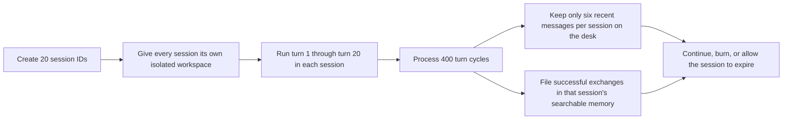
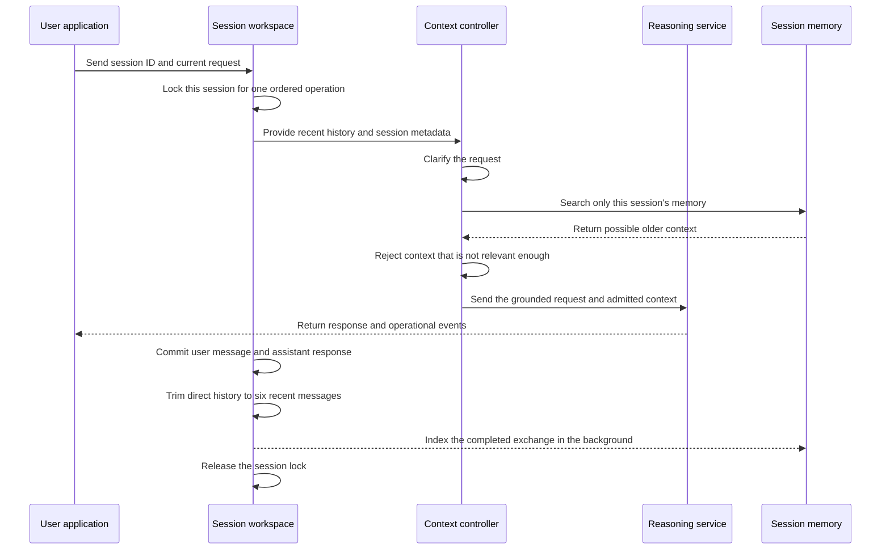

# SC-EVM 20-Turn, 20-Session Lifecycle

## Purpose

This document explains how SC-EVM handles a workload made of **20 independent sessions**, with
**20 completed conversation turns in each session**. It describes the current implementation at a
high level and uses plain language wherever possible.

SC-EVM is a developer preview. This workflow explains logical behavior; it does not claim
production certification, enterprise authorization, or physical erasure of server memory.

## The Short Version

Think of SC-EVM as a librarian responsible for 20 locked study rooms:

- Each room is one session.
- Each room has its own recent notes and searchable memory.
- A question asked in one room cannot intentionally use notes from another room.
- The librarian keeps only the latest six messages on the desk.
- Older successful exchanges can be filed in that room's searchable memory.
- Before answering, the librarian finds only the older notes that appear relevant.
- When the room is burned, its active record and searchable memory are removed from the service.

Twenty turns in twenty sessions therefore produce **400 successful turn cycles**. Assuming every
turn succeeds, those cycles contain 400 user messages and 400 assistant responses.

## Terms Used in This Document

| Term | Plain-language meaning |
|---|---|
| Session | One isolated conversation workspace with its own identifier and lifecycle. |
| Turn | One user request followed by one successful assistant response. |
| Recent history | The latest messages kept directly available to the next request. |
| Searchable memory | Older completed exchanges that can be recalled when relevant. |
| Grounded request | A clarified version of the current request, combined with selected context. |
| Burn | Explicit logical deletion of one session and its session-scoped searchable memory. |

> **Important:** The current `MAX_HISTORY_TURNS` setting is enforced as a message count. Its
> default is six messages, which is normally three complete user-and-assistant exchanges.

## Workload at a Glance

The 20 sessions may make progress at the same time because each session has its own lifecycle lock.
Within a single session, turns are processed in order. If two requests arrive for the same session
at once, one waits for the other instead of changing the same state simultaneously.

Shared resources—such as the reasoning service, network connections, and worker capacity—still
limit total throughput. Session isolation does not mean unlimited parallel execution.

## One Turn from Start to Finish

Every turn follows the same controlled path.

### 1. Identify and lock the session

The request includes a session ID. SC-EVM finds that session or creates it when the query path
allows creation. It then takes the lock belonging only to that session.

In layman's terms: the librarian closes the study-room door briefly so two people cannot rearrange
the same desk at the same time.

### 2. Take a state snapshot

SC-EVM reads the session's current state:

- the latest six messages;
- session-scoped facts and metadata;
- the session's searchable memory;
- the session's integrity record; and
- the time the session was last used.

This snapshot belongs only to the selected session.

### 3. Clarify the current request

People often use shorthand such as “change that,” “continue,” or “use the earlier decision.”
SC-EVM uses the recent messages to produce:

- a compact search description for finding relevant older material; and
- a fully stated version of the request for the reasoning step.

If clarification fails, the original user request is used as the safe fallback.

### 4. Search the session's older memory

SC-EVM searches only the memory collection attached to the active session. Candidate memories are
checked against relevance rules. A memory that happens to be available is not automatically allowed
into the answer context.

In layman's terms: the librarian looks in the correct room's filing cabinet, then discards folders
that do not closely match the current question.

If retrieval fails, SC-EVM can continue with no retrieved context rather than mixing in unverified
material.

### 5. Build a bounded context package

The admitted memories and clarified request are placed into a structured package. Recalled material
is treated as reference context, not as a new instruction.

SC-EVM does **not** resend all 20 previous turns by default. It sends the bounded recent-message
window plus any older material selected for the current request. This bounds direct transcript
growth, but it does not make total prompt size constant; retrieved context and response size still
vary by turn.

### 6. Ask the reasoning service

The reasoning layer receives the grounded request and selected context. It produces:

- the assistant response;
- an intent classification;
- optional structured action information;
- optional facts to remember inside the session; and
- usage information when available.

The current runtime may use more than one reasoning call internally, but model count is not the
product lifecycle boundary. The session and context rules remain the same.

### 7. Deliver observable events

The API returns staged server-sent events so the client can observe the operation:

1. metadata;
2. clarified request information;
3. retrieved context when diagnostic mode is enabled;
4. completed response content;
5. structured action information;
6. usage information;
7. intent; and
8. completion.

The current response-content event contains the completed response. It should not be described as
true provider-token streaming.

### 8. Commit only a successful turn

After successful generation, SC-EVM appends two messages:

1. the user's request; and
2. the assistant's response.

It then removes the oldest messages until only six remain and refreshes the session's integrity
record.

If response generation fails, SC-EVM emits an error and does **not** commit an empty or partial turn
to conversation history.

### 9. File the completed exchange

The successful user-and-assistant exchange is scheduled for background indexing. This keeps the
memory filing step from extending the visible response path.

The most recent exchange is already present in direct history before the next operation in that
session can proceed. The searchable copy may finish shortly afterward. If the session is burned
before indexing finishes, the background task stops instead of recreating the deleted session.

## How One Session Changes Across 20 Turns

| Stage | What remains directly visible | What happens to older successful exchanges |
|---|---|---|
| Turn 1 | The first user request and response are committed. | The exchange is scheduled for indexing. |
| Turns 2–3 | Up to six recent messages remain directly available. | Earlier exchanges begin accumulating in searchable memory. |
| Turn 4 | The oldest messages start leaving the direct six-message window. | Relevant older exchanges can be recalled from session memory. |
| Turns 5–19 | The six-message window slides forward after every successful turn. | Search and relevance policy decide what older material returns. |
| Turn 20 | The latest six messages remain directly available. | Up to 20 successful exchanges may exist in searchable memory if indexing succeeded. |

The important behavior is not that SC-EVM “remembers all 20 turns” in every answer. It keeps a
small recent workspace and selectively recalls older exchanges when the current request makes them
relevant.

## What Happens Across 20 Sessions

Each session has a separate:

- session record;
- recent-message window;
- searchable memory collection;
- lifecycle lock;
- last-accessed timestamp;
- metadata registry; and
- integrity record.

Consider three of the twenty sessions:

| Session | Example purpose | Context allowed |
|---|---|---|
| `billing-review` | Discuss invoice behavior | Only recent and recalled material from `billing-review` |
| `api-redesign` | Plan an API change | Only recent and recalled material from `api-redesign` |
| `incident-104` | Investigate an outage | Only recent and recalled material from `incident-104` |

A request in `api-redesign` does not intentionally search `billing-review` or `incident-104`.
The session ID is the boundary used throughout retrieval, history management, locking, and burn.

### Default workload footprint

Assuming 20 successful turns in all 20 sessions:

| Item | Approximate count |
|---|---:|
| Active sessions | 20 |
| Successful turn cycles | 400 |
| User messages produced | 400 |
| Assistant responses produced | 400 |
| Direct recent messages retained across all sessions | At most 120 by default |
| Searchable exchanges before deletion | Up to 400 if all background indexing succeeds |

These counts describe logical records, not memory consumption, token cost, or performance.
Message length, retrieved context, provider behavior, and indexing success all affect real resource
use.

## Session End States

A session can end in four ways.

### Explicit burn

An operator or client requests burn for one session. SC-EVM removes the session from the active
registry and deletes its session-scoped searchable collection.

Burn is logical deletion. It does not promise that every physical byte in server RAM has been
overwritten.

### Idle expiration

The background collector periodically looks for sessions that have not been used recently. With the
current defaults:

- a session becomes eligible after 3,600 seconds of inactivity; and
- the collector checks every 300 seconds.

Both values are configurable.

### Capacity eviction

If the configured active-session limit is reached, the least recently used eligible sessions can be
removed to make room. The current default limit is 1,024 active sessions, so a 20-session workload
is below that limit.

### Service shutdown or restart

The active registry and session memory are designed as ephemeral process state. They must not be
treated as a durable system of record.

## Failure and Recovery Behavior

| Failure point | Current behavior |
|---|---|
| Request clarification fails | Continue with the original request. |
| Memory lookup fails | Continue without retrieved memory. |
| Reasoning fails | Emit an error; do not commit the failed turn. |
| Background indexing fails | Keep the recent chat entry, log the indexing failure, and continue operating. |
| Session is burned during background work | Abort the background write. |
| Two turns target the same session | Process them in lock order instead of mutating state simultaneously. |
| Turns target different sessions | Allow independent progress, subject to shared capacity. |

## What This Design Prevents

- One session intentionally searching another session's memory.
- Unlimited direct transcript growth across 20 turns.
- Two same-session requests writing state at the same time.
- Failed model generations becoming valid conversation history.
- A delayed background index task restoring a burned session.
- Retrieved text silently replacing the current control instructions.

## What This Design Does Not Guarantee

- Production-grade authentication or authorization.
- Physical RAM sanitization after burn.
- Constant token usage per turn.
- Unlimited concurrency or fixed latency for 400 requests.
- Perfect retrieval relevance or perfect answer correctness.
- Durable recovery after process loss.
- True provider-token streaming in the current response path.

## Operator Checkpoints for a 20-by-20 Run

1. Create 20 unique session IDs.
2. Confirm that the session list contains exactly those 20 IDs.
3. Run 20 ordered turns in each session.
4. Verify that direct history never exceeds six messages per session.
5. Use session-specific facts to test that context does not cross session boundaries.
6. Confirm that successful exchanges become searchable within their own session.
7. Inject a failed generation and verify that it is not committed.
8. Send overlapping requests to one session and verify ordered processing.
9. Send requests to different sessions and observe independent progress.
10. Burn selected sessions and verify that their records and searchable collections are unavailable.
11. Record latency, usage, retrieval, failure, and deletion evidence without weakening the
    methodology when a prerequisite fails.

## Related Documentation

- [Product Manifesto](../MANIFESTO.md)
- [Product Boundary](../PRODUCT_BOUNDARY.md)
- [Architecture](../ARCHITECTURE.md)
- [Architecture Overview](ARCHITECTURE_OVERVIEW.md)
- [Security Limitations](SECURITY_LIMITATIONS.md)
- [Evaluation Methodology](EVALUATION_METHODOLOGY.md)

