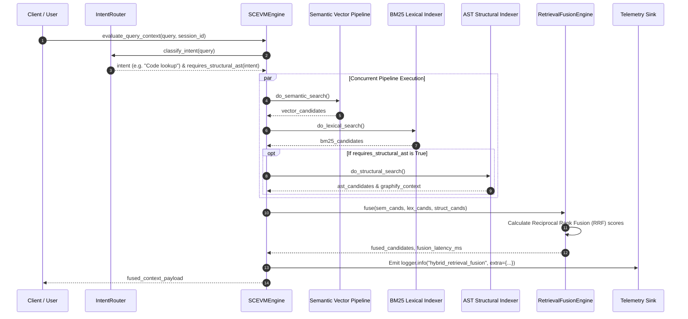

# Architecture Decision Record (ADR): Phase 2 Hybrid Retrieval Fusion Engine

* **Status:** Accepted & Implemented
* **Component:** `src/services/fusion_engine.py`, `src/services/bm25_indexer.py`, `src/services/ast_indexer.py`, `src/services/intent_router.py`, `src/sc_evm.py`
* **Date:** 2026-08-04

---

## 1. Executive Summary

Phase 2 upgrades the SC-EVM retrieval system into a **Hybrid Semantic + Lexical + Structural Search Engine**. Retrieval requests are categorized by prompt intent via an `IntentRouter`. Three independent retrieval pipelines run concurrently:
1. **Semantic (Vector):** Dense vector similarity over session memory via ChromaDB and `AdaptiveThresholdEngine`.
2. **Lexical (BM25):** Token-level BM25Okapi keyword scoring over code, docstrings, configuration keys, and SQL schemas.
3. **Structural (AST & Graph):** Symbol graph parsing (classes, functions, interfaces, routes, configs, environment variables, DB migrations) and `Graphify` relationship traversal.

Candidates are fused using **Reciprocal Rank Fusion (RRF)** with runtime-configurable weights (`FUSION_SEMANTIC_WEIGHT`, `FUSION_LEXICAL_WEIGHT`, `FUSION_STRUCTURAL_WEIGHT`).

---

## 2. Architecture & Pipeline Sequence Diagram



---

## 3. Intent Routing & Structural Gating Policy

To preserve latency budget, **only structural requests** trigger AST and graph traversal.

| Intent Category | Triggers AST Traversal? | Description |
| :--- | :---: | :--- |
| **`Conversation`** | ❌ No | Chit-chat or general dialogue. |
| **`Question answering`** | ❌ No | Theoretical or explanatory queries. |
| **`Code lookup`** | ✅ **Yes** | Searching for specific function, class, variable, or route definitions. |
| **`Architecture`** | ✅ **Yes** | High-level system structure, module maps, and flow queries. |
| **`Dependency analysis`** | ✅ **Yes** | Investigating import trees, callers, and component dependencies. |
| **`Refactoring`** | ✅ **Yes** | Code restructuring, renaming, or extraction tasks. |

---

## 4. Reciprocal Rank Fusion (RRF) Formula

Candidates from each pipeline are merged into a single ranked list using Reciprocal Rank Fusion (RRF):

\[
\text{Score}_{\text{RRF}}(d) = \sum_{p \in \{\text{semantic}, \text{lexical}, \text{structural}\}} w_p \cdot \frac{1}{k + \text{rank}_p(d)}
\]

Where:
- \(k = 60\) (standard RRF smoothing constant)
- \(w_{\text{semantic}} = \text{settings.FUSION\_SEMANTIC\_WEIGHT}\) (default `0.5`)
- \(w_{\text{lexical}} = \text{settings.FUSION\_LEXICAL\_WEIGHT}\) (default `0.3`)
- \(w_{\text{structural}} = \text{settings.FUSION\_STRUCTURAL\_WEIGHT}\) (default `0.2`)

---

## 5. Incremental Indexing

1. **Hash & Mtime Validation:** `ASTIndexer` tracks SHA256 hashes of indexed files. When repository files are modified, only affected files are re-parsed.
2. **Index Synchronization:** Vector and BM25 indexes are synchronized automatically during retrieval requests to prevent stale memory artifacts.

---

## 6. Observability Telemetry

Every hybrid search execution emits a structured log event:

```json
{
  "event": "hybrid_retrieval_fusion",
  "query": "Where is function get_user_profile defined?",
  "intent": "Code lookup",
  "retrievers_used": ["semantic", "lexical", "structural"],
  "fusion_weights": {
    "semantic": 0.5,
    "lexical": 0.3,
    "structural": 0.2
  },
  "candidate_counts": {
    "semantic": 3,
    "lexical": 5,
    "structural": 2
  },
  "fusion_latency_ms": 0.18,
  "retrieval_latency_ms": 1.42,
  "chosen_evidence": [
    "def get_user_profile(user_id: str) (File: main.py:L24)",
    "UserProfile class in profile.py"
  ]
}
```
