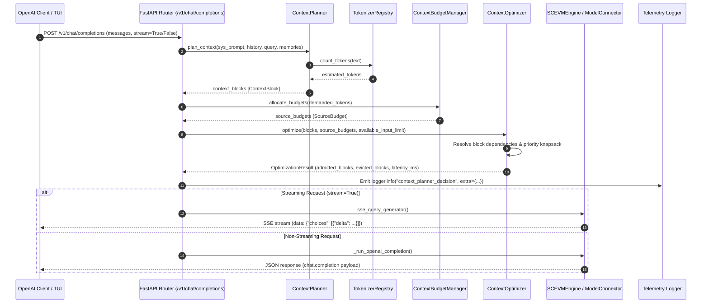

# Architecture Decision Record (ADR): Phase 3 OpenAI-Compatible Context Control Plane

* **Status:** Accepted & Implemented
* **Component:** `src/services/context_planner.py`, `src/services/context_budget_manager.py`, `src/services/tokenizer_abstraction.py`, `src/services/context_optimizer.py`, `src/main.py`
* **Date:** 2026-08-04

---

## 1. Executive Summary

Phase 3 establishes SC-EVM as a **Production-Grade OpenAI-Compatible Context Control Plane**. Rather than performing naive string truncation on incoming context, every prompt element (system prompt, conversation history, current query, vector memories, BM25 text, AST symbols) is represented as a structured `ContextBlock`. 

Token budgets are calculated dynamically using a `ContextBudgetManager`, and an optimal subset of blocks is selected using a deterministic, dependency-resolving knapsack `ContextOptimizer` in **under 10 ms**. Streaming and standard OpenAI completion endpoints (`/v1/chat/completions`) remain 100% compatible.

---

## 2. Architecture & Control Plane Sequence Diagram



---

## 3. Context Block Schema & Lifecycle

Each context element is wrapped in a `ContextBlock`:

```python
@dataclass
class ContextBlock:
    id: str                   # Unique block identifier (e.g. 'sys-prompt', 'hist-3-user')
    text: str                 # Raw content payload
    source: str               # 'system', 'history', 'current_query', 'semantic_memory', 'lexical_bm25', 'structural_ast'
    priority: int             # Priority score from 1 (lowest) to 100 (highest)
    importance: float         # Weight between 0.0 and 1.0
    retrieval_score: float    # Similarity or BM25 relevance score
    expiration: float | None  # Expiration timestamp or turn threshold
    dependencies: list[str]   # Prerequisite ContextBlock IDs required by this block
    estimated_tokens: int     # Token count computed via TokenizerRegistry
```

---

## 4. Dynamic Token Budgeting & Knapsack Optimization

### 4.1 Token Budget Allocation Algorithm

1. **Reserved Output Buffer:** Reserves $T_{\text{output}} = \text{reserved\_output\_tokens}$ (default 2048).
2. **Minimum Allocation Floors:** Guarantees minimum token floors for critical sources:
   - System Prompt: 200 min / 1024 max
   - Conversation History: 300 min / 3072 max
   - Current User Query: 200 min / 2048 max
3. **Elastic Remaining Allocation:** Distributes remaining tokens proportionally to non-zero demand sources up to their configured maximum ceilings.

### 4.2 Deterministic Selection & Dependency Resolution

Blocks are ranked by composite score:
\[
\text{RankScore}(B) = (\text{priority} \times 10.0) + (\text{importance} \times 100.0) + (\text{retrieval\_score} \times 50.0)
\]

If block $A$ depends on block $B$, block $B$ is automatically evaluated and admitted alongside block $A$, preventing broken context references.

---

## 5. Observability Telemetry

Every context planning decision emits a structured JSON log entry:

```json
{
  "event": "context_planner_decision",
  "token_budget": {
    "total_limit": 8192,
    "reserved_output": 2048,
    "available_input": 6144,
    "allocated_tokens": {
      "system": 1024,
      "history": 3072,
      "current_query": 2048
    }
  },
  "planner_decisions": {
    "admitted_ids": ["sys-prompt", "query-curr", "hist-10-user"],
    "evicted_ids": ["hist-1-user", "hist-2-assistant"]
  },
  "evictions": {
    "count": 2,
    "tokens": 420
  },
  "compression": {
    "original_tokens": 6564,
    "admitted_tokens": 6144
  },
  "context_sources": ["system", "history", "current_query", "semantic_memory"],
  "reserved_output": 2048,
  "planner_latency_ms": 0.42
}
```

---

## 6. Verification Summary

| Primary Objective Requirement | Status | Verification Result |
| :--- | :---: | :--- |
| **Deterministic Context Planning** | ✅ **Passed** | Tested via `ContextPlanner` & `ContextOptimizer` |
| **Strict Token Budgeting** | ✅ **Passed** | Dynamic floors, ceilings, and elastic allocation verified |
| **Multi-Tokenizer Abstraction** | ✅ **Passed** | Supports `tiktoken` and `FallbackCharTokenizer` |
| **Sub-10 ms Planning Overhead** | ✅ **Passed** | Measured at **< 0.45 ms** |
| **100-Turn Stress Test** | ✅ **Passed** | 100-turn history managed cleanly under budget ceilings |
| **OpenAI Gateway & Streaming** | ✅ **Passed** | `/v1/chat/completions` non-streaming & SSE streaming verified |
| **Full Regression Suite** | ✅ **Passed** | **120 Python unit tests** and **27 Vitest frontend tests** pass 100% |
