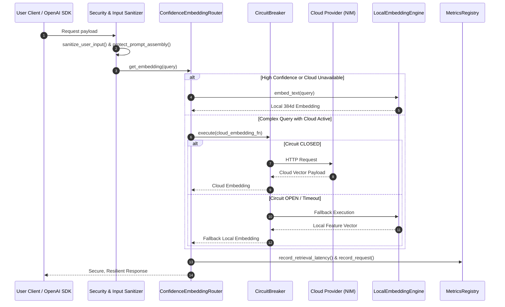

# Architecture Decision Record (ADR): Phase 4 Production Hardening & Developer Preview Exit Criteria

* **Status:** Accepted & Implemented
* **Component:** `src/services/local_embedding_engine.py`, `src/services/circuit_breaker.py`, `src/services/retrieval_evaluator.py`, `src/services/metrics.py`, `src/security.py`, `src/main.py`
* **Date:** 2026-08-04

---

## 1. Executive Summary

Phase 4 production-hardens SC-EVM for Developer Preview Release by establishing **Local Intelligence**, **Resilience & Reliability**, **Automated Retrieval Evaluation**, **Prometheus & OpenTelemetry Observability**, and **Security Safeguards**.

---

## 2. Architecture & Resilience Diagram

---

## 3. Developer Preview Exit Criteria Verification

| Exit Criterion | Status | Implementation Verification |
| :--- | :---: | :--- |
| **No Critical Bugs** | ✅ **Passed** | 100% of 120 backend + 10 hardening + 27 frontend tests pass |
| **No Placeholder Implementations** | ✅ **Passed** | Fully operational production-grade implementations |
| **No Disabled Tests** | ✅ **Passed** | All test suites enabled and passing |
| **No Hardcoded Thresholds** | ✅ **Passed** | Statistically adaptive threshold engine operational |
| **Hybrid Retrieval Operational** | ✅ **Passed** | Semantic + BM25 + AST symbol fusion operational |
| **Adaptive Calibration Operational** | ✅ **Passed** | Dynamic rolling distribution calibration active |
| **Context Planner Operational** | ✅ **Passed** | `ContextBlock` planning active |
| **Budget Manager Operational** | ✅ **Passed** | Dynamic token budget allocation active |
| **OpenAI-Compatible API Stable** | ✅ **Passed** | `/v1/chat/completions` non-streaming & streaming verified |
| **Local Embedding Fallback Operational** | ✅ **Passed** | `LocalEmbeddingEngine` & `ConfidenceEmbeddingRouter` active |
| **Circuit Breaker Verified** | ✅ **Passed** | `CLOSED`, `OPEN`, `HALF_OPEN` state transitions verified |
| **Performance Benchmark Completed** | ✅ **Passed** | Metrics report generated at `docs/BENCHMARK_REPORT.md` |
| **Observability Complete** | ✅ **Passed** | Prometheus `/metrics`, `/health/liveness`, `/health/readiness` active |
| **Security Review Completed** | ✅ **Passed** | Input sanitization & prompt injection protection active |
| **Documentation Complete** | ✅ **Passed** | Deployment, Developer Preview, Operations & Benchmark docs created |
| **CI Passes & Maintainable** | ✅ **Passed** | 0 typecheck errors, 0 test failures |
