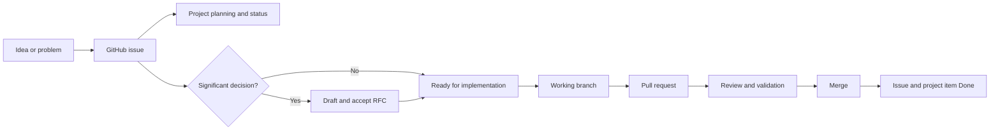

# SC-EVM GitHub Projects Operating Guide

This guide explains how SC-EVM uses GitHub Issues, Projects, RFCs, branches, pull requests, and commits to move an idea into verified software. It is written for someone using a project manager for the first time.

## 1. The Simple Mental Model

Think of the system as five connected records:

| Record | Plain-language meaning | Example |
| --- | --- | --- |
| Issue | A unit of work or a problem to solve | “Add authenticated session ownership” |
| Project | The control board showing where every issue stands | “SC-EVM Product & Engineering” |
| RFC | The decision record for a significant product or architecture change | “RFC-0004 — Provider Abstraction” |
| Pull request | The proposed code or documentation change | “Implement provider capability contract” |
| Commit | A saved group of exact file changes | `feat: add provider capability contract` |

The relationship is:



The repository stores the product. The project board organizes the work. The project board does not replace the Manifesto, Product Boundary, Architecture, or RFCs.

## 2. Source-of-Truth Order

When two records disagree, use this order:

1. [Product Manifesto](../MANIFESTO.md)
2. [Product Boundary](../PRODUCT_BOUNDARY.md)
3. Accepted [RFCs](../rfcs/README.md)
4. Canonical [Architecture](../ARCHITECTURE.md)
5. GitHub issue acceptance criteria
6. GitHub Project fields and status
7. Pull-request description
8. Informal comments or chat

A project card cannot authorize work outside the Product Boundary. A significant architecture change cannot move to **Ready** until its RFC is accepted.

## 3. The SC-EVM Project

Project name:

> **SC-EVM Product & Engineering**

Project purpose:

> One execution system for product, architecture, security, evaluation, documentation, and operations work. Every item must strengthen Relevance, Isolation, Control, or Evidence and remain aligned with the Product Manifesto and Product Boundary.

The project tracks:

- repository issues;
- active pull requests;
- RFC preparation and review;
- public-pilot and production blockers;
- evaluation and evidence work;
- operational and documentation work.

It does not track:

- vague ideas without a problem statement;
- personal reminders unrelated to SC-EVM;
- work that contradicts the Product Boundary;
- implementation tasks for an unaccepted significant RFC;
- completed commits that have no issue or pull request.

## 4. Status Workflow

Every project item has exactly one status.

| Status | Meaning | Entry rule | Exit rule |
| --- | --- | --- | --- |
| **Inbox** | Newly captured and not yet evaluated | Any legitimate new item | Product owner triages it |
| **Backlog** | Valid work, but not ready or scheduled | Purpose and product fit are clear | Dependencies and acceptance criteria are complete |
| **Ready** | Safe and clear to begin | Acceptance criteria are testable; required RFC is accepted | Someone starts work |
| **In Progress** | Actively being implemented | An owner and working branch exist | Pull request is opened or work becomes blocked |
| **Review** | Awaiting code, architecture, evidence, or product review | Pull request or RFC review is active | Review passes, changes are requested, or item is blocked |
| **Blocked** | Cannot progress because a named dependency is unresolved | Blocker and unblock condition are written in the issue | Blocker is resolved |
| **Done** | Completed and verified | Acceptance criteria pass and change is merged or decision is recorded | Reopen only when completion was incorrect |

Normal flow:

```text
Inbox → Backlog → Ready → In Progress → Review → Done
                         ↘ Blocked ↗
```

Do not move an item to **Done** merely because code was written. It must meet its acceptance criteria and complete the required review.

## 5. Project Fields

Fields describe the work without multiplying labels.

### Status

Use the seven workflow states above.

### Priority

| Value | Meaning |
| --- | --- |
| **P0 — Critical** | Active security, data-loss, or release-stopping problem; address immediately |
| **P1 — High** | Required for the next meaningful product or release gate |
| **P2 — Medium** | Important improvement with no immediate release block |
| **P3 — Low** | Useful cleanup, research, or optional improvement |

Priority describes urgency and impact—not task size.

### Type

- **Product**
- **Architecture / RFC**
- **Engineering**
- **Security**
- **Evaluation**
- **Documentation**
- **Operations**

### Product Pillar

Every item must map to at least one Manifesto pillar:

- **Relevance**
- **Isolation**
- **Control**
- **Evidence**

If an item maps to none of them, reconsider whether it belongs in SC-EVM.

### Release Gate

- **Developer Preview**
- **Public Pilot**
- **Production**
- **Research / No Release**

This is the earliest boundary the work affects. It is not a promised release date.

### RFC Required

- **Yes**
- **No**
- **To Determine**

Use **Yes** for the changes listed in [When an RFC is required](../rfcs/README.md#when-an-rfc-is-required).

### Effort

| Value | Expected scope |
| --- | --- |
| **XS** | A few hours; one narrow change |
| **S** | About one focused day |
| **M** | Several days or multiple related files |
| **L** | A substantial subsystem or cross-cutting change |
| **XL** | Too large for one issue; split before moving to Ready |

Effort is a planning estimate, not a performance judgment.

## 6. Project Views

The same issues appear in several views. Moving an item in one view updates it everywhere.

### Execution Board

- Layout: Board
- Group by: Status
- Purpose: daily view of work moving from Inbox to Done

### Prioritized Backlog

- Layout: Table
- Filter: `status:Inbox,Backlog,Ready`
- Group by: Priority
- Sort: Priority, then oldest updated
- Purpose: decide what should be prepared or started next

### Current Work

- Layout: Table or Board
- Filter: `status:"In Progress",Review,Blocked`
- Purpose: expose active work and blockers

### RFCs and Decisions

- Layout: Table
- Filter: `RFC Required:Yes`
- Group by: Status
- Purpose: ensure significant changes pass governance before implementation

### Release Gates

- Layout: Table
- Group by: Release Gate
- Sort: Priority
- Purpose: show what blocks Developer Preview, Public Pilot, or Production

### Roadmap

- Layout: Roadmap
- Use only after target dates are based on real capacity.
- Purpose: communicate sequencing, not promise dates.

## 7. Automation Rules

Configure the project so routine state changes do not depend on memory:

1. Automatically add every newly opened issue or pull request from `roshithrg147/ephemeral-engine`.
2. Set newly added items to **Inbox**.
3. When an issue or pull request closes, set it to **Done**.
4. When an issue or pull request reopens, set it to **Inbox**.
5. Do not automatically move an opened pull request to **Review** unless the linked issue is known; update the linked issue deliberately.
6. Archive old **Done** items only after they are no longer useful in current reporting.

Automation manages mechanics. It does not decide priority, product fit, RFC requirements, or acceptance.

## 8. How to Create Work

### Bug

Use the Bug Report template when behavior is incorrect.

Good title:

> `[Bug]: Burned session can be recreated by a pending index task`

A useful bug includes:

- affected version or commit;
- environment;
- exact reproduction steps;
- actual behavior;
- expected behavior;
- security or data impact;
- evidence such as logs or a failing test.

### Feature or product change

Use the Feature Request template.

Start with the user or system problem—not the proposed implementation.

Good:

> Operators cannot determine whether retrieved context came from the active session.

Weak:

> Add another database field.

### Architecture change

Use the Architecture / RFC template when the change affects boundaries, persistence, security, providers, compatibility, context policy, benchmarks, or commercial packaging.

The issue coordinates the work. The RFC records the decision.

### Engineering task

Use the Engineering Task template for bounded implementation, testing, cleanup, or operational work that does not need a new architecture decision.

## 9. Triage: Inbox to Backlog

Review Inbox items regularly. For each item, answer:

1. What concrete problem exists?
2. Is there evidence that the problem exists?
3. Does solving it strengthen Relevance, Isolation, Control, or Evidence?
4. Is it inside the Product Boundary?
5. Does it duplicate another issue or accepted decision?
6. Does it require an RFC?
7. What release boundary does it affect?
8. What is the smallest testable outcome?

Then:

- reject or close items that do not belong;
- merge duplicates;
- request missing information;
- move valid but incomplete work to **Backlog**;
- move fully defined work to **Ready**.

## 10. Definition of Ready

An issue may enter **Ready** only when:

- the problem and desired outcome are clear;
- product pillar and release gate are assigned;
- priority and effort are assigned;
- acceptance criteria are observable and testable;
- dependencies and blockers are named;
- security, privacy, and evidence impacts were considered;
- a required RFC is accepted;
- the work is small enough for one owner and one coherent pull request.

If any answer is missing, keep the item in **Backlog**.

## 11. Starting Work

1. Assign an owner.
2. Move the item to **In Progress**.
3. Create a branch from current `main`.
4. Use a descriptive branch such as:

```text
agent/issue-12-session-auth
```

5. Keep the issue updated when assumptions or blockers change.
6. If a new architectural decision appears, stop implementation and open or update the RFC.

Only one person or agent should actively own an issue at a time.

## 12. Pull Requests and Review

A pull request must:

- link the issue with `Closes #<number>` when merging should close it;
- link the RFC when one governed the work;
- explain what changed and why;
- state user/developer impact;
- list validation performed;
- describe risk and rollback;
- avoid unrelated changes.

When the pull request is ready for review:

1. move the linked issue to **Review**;
2. verify automated and manual checks;
3. resolve review comments;
4. merge only when acceptance criteria pass;
5. confirm the issue and project item moved to **Done**.

## 13. Definition of Done

Work is Done only when all applicable conditions hold:

- acceptance criteria pass;
- tests, lint, and builds pass;
- security and privacy impacts are addressed;
- documentation matches behavior;
- the pull request is reviewed and merged;
- any RFC decision and evidence are recorded;
- no required follow-up is hidden in comments;
- the project fields reflect the final result.

If follow-up work remains, create a new issue before closing the current one.

## 14. Blocked Work

When an item is blocked:

1. move it to **Blocked**;
2. add a comment beginning with `Blocked by:`;
3. link the dependency, decision, person, or external event;
4. state the exact condition that will unblock it;
5. do not leave blocked work assigned as if it were active.

Example:

```text
Blocked by: RFC-0004 is still Under Review.
Unblocks when: the provider capability and error contracts are Accepted.
```

## 15. Suggested Operating Rhythm

### Daily, when actively building

- Review **Current Work**.
- Resolve or update blockers.
- Move opened pull requests to **Review**.
- Ensure active work has one owner.

### Weekly

- Empty the **Inbox**.
- Reorder the **Prioritized Backlog**.
- Review P0/P1 items and release blockers.
- Close stale or duplicated work.
- Check whether any implementation started without a required RFC.

### Before a release or public claim

- Review the **Release Gates** view.
- Confirm security and evaluation evidence.
- Confirm all claim-bearing work follows the accepted benchmark methodology.
- Treat unresolved Public Pilot or Production blockers as release blockers, not documentation notes.

## 16. Worked Example

Problem:

> The HTTP API accepts any client-provided session ID and has no authenticated owner.

Project record:

| Field | Value |
| --- | --- |
| Status | Backlog |
| Priority | P0 — Critical |
| Type | Security |
| Product Pillar | Isolation |
| Release Gate | Public Pilot |
| RFC Required | Yes |
| Effort | XL, therefore split before Ready |

Lifecycle:

1. Create a security/architecture issue.
2. Draft an RFC defining identity, session ownership, authorization, migration, and validation.
3. Keep implementation issues in Backlog while the RFC is Draft or Under Review.
4. Accept the RFC.
5. Split implementation into bounded issues.
6. Move the first issue to Ready.
7. Implement through a linked pull request.
8. Verify cross-session access tests and deployment behavior.
9. Merge and move the issue to Done.

## 17. Common Mistakes

- Putting every idea directly into **Ready**.
- Treating priority as task size.
- Using labels and project fields for the same information.
- Starting architecture work before RFC acceptance.
- Leaving issues **In Progress** when nobody is working on them.
- Closing an issue because code exists, before validation and documentation.
- Hiding follow-up work in pull-request comments.
- Using roadmap dates as promises without capacity evidence.
- Treating the project board as more authoritative than the Manifesto or Product Boundary.

## 18. First-Time User Checklist

When you open GitHub:

1. Open the **SC-EVM Product & Engineering** project.
2. Look at **Current Work** first.
3. If adding work, choose the correct issue template.
4. Let the new issue enter **Inbox**.
5. During triage, fill in all project fields.
6. Do not move it to **Ready** until the Definition of Ready passes.
7. When starting, assign yourself and move it to **In Progress**.
8. Link the issue from the pull request.
9. Move it to **Review** when the pull request is ready.
10. Confirm it becomes **Done** only after merge and verification.

That is the complete operating loop. Start with discipline and a small number of well-defined issues; the board becomes valuable because its state remains trustworthy.
