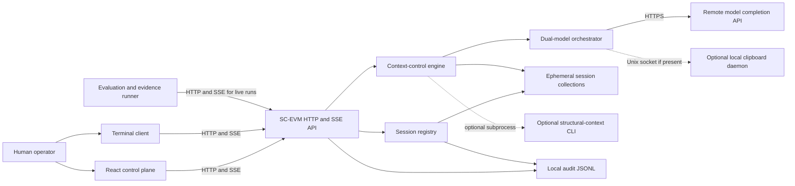
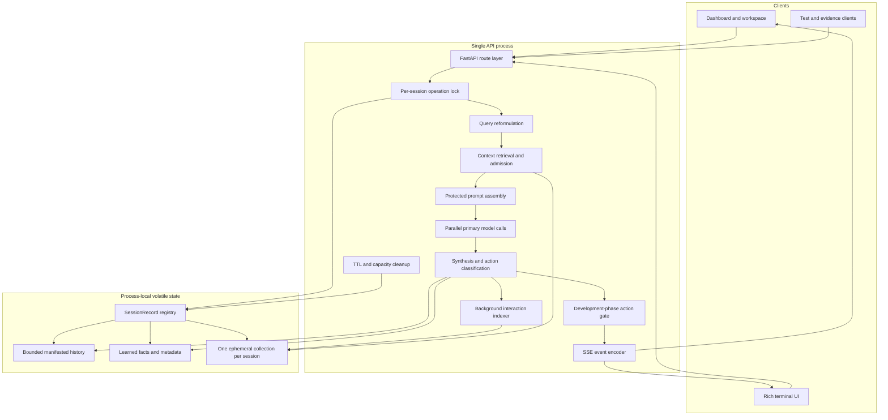
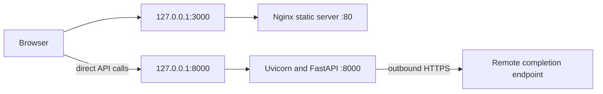
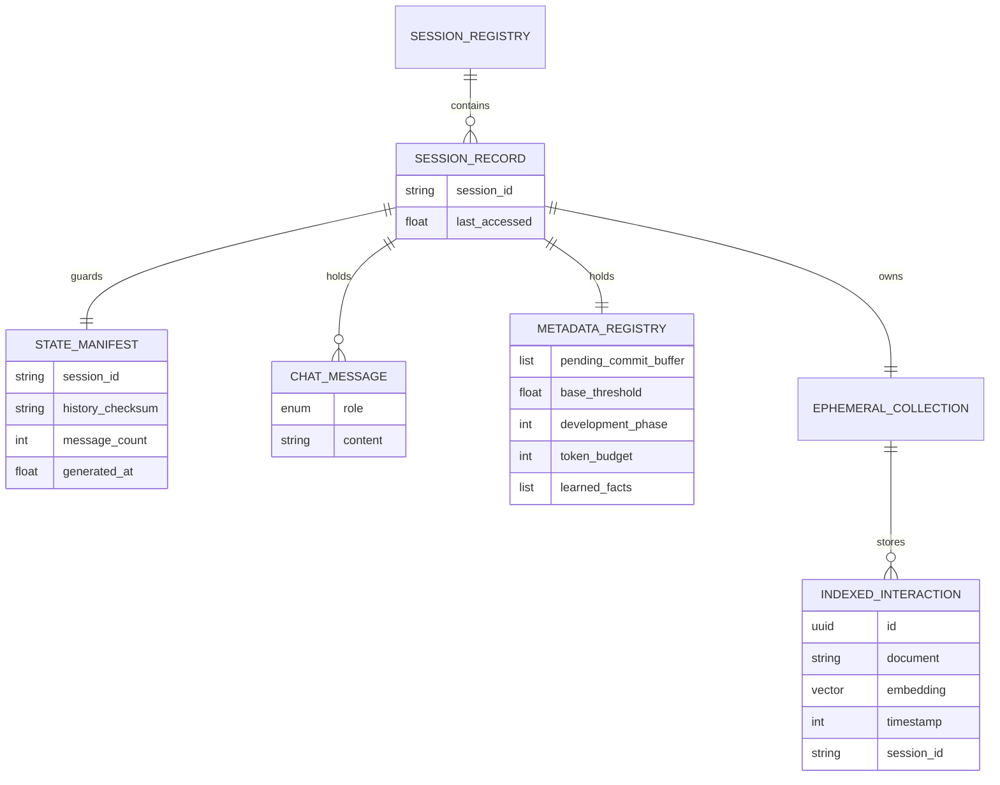
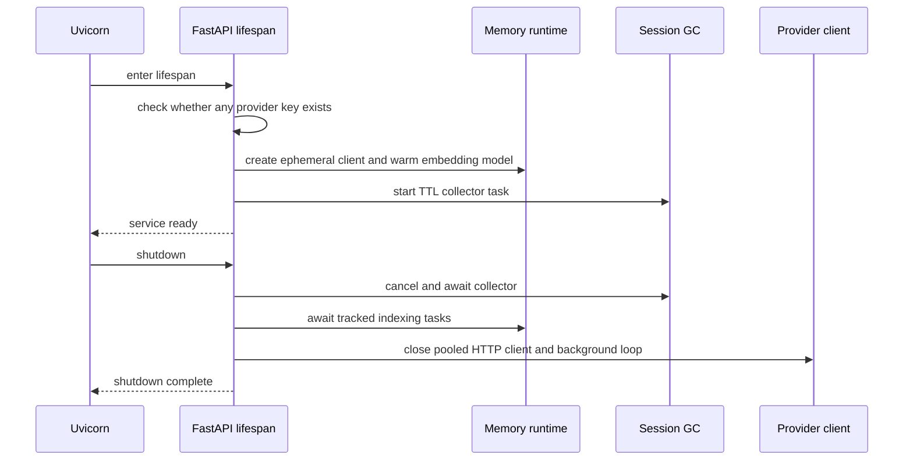
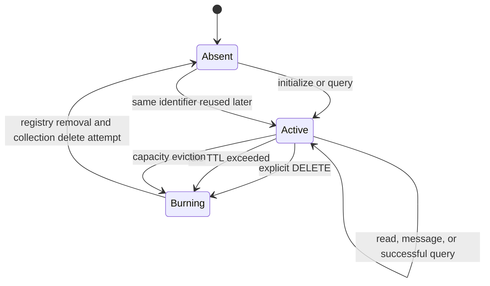
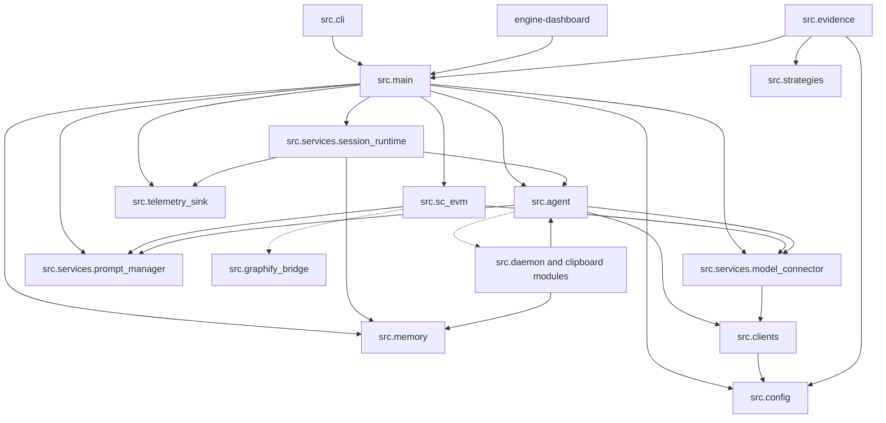

# SC-EVM System Architecture and Workflow Specification

| Field | Value |
| --- | --- |
| Document type | Code-derived reverse specification |
| System | SC-EVM (State-Cached Ephemeral Vector Memory) |
| Baseline | Current repository working tree, inspected 2026-07-18 |
| Intended reader | Engineer rebuilding or taking over the system |
| Confidence convention | **Observed** means directly implemented; **inferred** means a design intent inferred from code or governance documents |

This document specifies the behavior that a clean-room implementation must reproduce. It describes the current implementation, including its boundaries and asymmetries; it is not a proposal for an improved successor. Governance intent comes from [MANIFESTO.md](../MANIFESTO.md), [PRODUCT_BOUNDARY.md](../PRODUCT_BOUNDARY.md), and [ARCHITECTURE.md](../ARCHITECTURE.md). Runtime claims are grounded in source code and locked configuration.

## 1. System Scope and Product Boundary

SC-EVM is a session-isolated context-control middleware placed between interactive clients and remote reasoning models. It bounds active conversation history, retrieves selected prior interactions, optionally adds structural context, performs multi-model response synthesis, emits lifecycle telemetry, and deletes session-scoped working state on demand.

The current repository contains five related but separable surfaces:

1. **Runtime API** — the authoritative HTTP and Server-Sent Events interface.
2. **Context and orchestration core** — session state, retrieval, context admission, model calls, synthesis, and action classification.
3. **Interactive clients** — a browser control plane and a terminal client.
4. **Optional local workstation utilities** — clipboard daemon, controlled file-diff tooling, session rehydration, and workspace indexing.
5. **Evaluation platform** — datasets, baselines, evidence artifacts, statistical analysis, and publication certification.

The runtime API has no user authentication or authorization. It is designed to be bound to a trusted local interface or placed behind an authenticated gateway. CORS is a browser-origin control and must not be treated as an access-control mechanism.

## 2. High-Level Architecture

### 2.1 Context diagram



### 2.2 Runtime component diagram



### 2.3 Deployment topology

The supplied Compose topology exposes both services only on loopback:



There is no reverse proxy from the frontend container to the backend. The browser calls the API origin directly. Therefore, the frontend build-time API URL and backend CORS origins must agree with the address visible to the browser.

## 3. Technology Stack and Locked Dependencies

### 3.1 Backend

The source declares Python `>=3.11`; the backend container pins the runtime family to `python:3.11-slim`. The committed `uv.lock` is the exact local dependency resolution.

| Responsibility | Package | Declared constraint | Locked version |
| --- | --- | --- | --- |
| HTTP API | FastAPI | `>=0.136.3` | `0.136.3` |
| ASGI server | Uvicorn | `>=0.49.0` | `0.49.0` |
| Validation/settings | Pydantic | `>=2.5.0` | `2.13.4` |
| Environment settings | pydantic-settings | `>=2.0.0` | `2.14.1` |
| HTTP client | HTTPX | `>=0.28.1` | `0.28.1` |
| Volatile retrieval store | Chroma | `>=1.5.9` | `1.5.9` |
| File coordination | filelock | `>=3.12.0` | `3.29.1` |
| Terminal interface | Rich | `>=13.0.0` | `15.0.0` |
| Test runner | pytest | `>=8.0.0` | `9.1.1` |
| Lint/format checks | Ruff | `>=0.12.0` | `0.15.22` |

Optional clipboard dependencies are declared as `cryptography>=41.0.0`, `Pillow>=9.0.0`, `pynput>=1.7.6`, `pyperclip>=1.8.2`, and `pystray>=0.19.3`.

Sources: [pyproject.toml](../pyproject.toml), [uv.lock](../uv.lock), [Dockerfile.backend](../Dockerfile.backend).

### 3.2 Frontend

The frontend is a client-rendered Create React App application. Exact installed top-level versions are locked in [engine-dashboard/package-lock.json](../engine-dashboard/package-lock.json).

| Responsibility | Package | Installed version |
| --- | --- | --- |
| UI runtime | React / React DOM | `19.2.7` |
| Routing | react-router-dom | `7.18.0` |
| Charts | Recharts | `3.9.0` |
| Icons | lucide-react | `1.21.0` |
| Build/test harness | react-scripts | `5.0.1` |
| Styling pipeline | Tailwind CSS | `3.4.19` |
| CSS processing | PostCSS / Autoprefixer | `8.5.15` / `10.5.2` |
| Component tests | Testing Library React | `16.3.2` |

The production image builds with Node 20 Alpine and serves static output through an unversioned `nginx:alpine` image. For bit-for-bit reproducibility, a replica should pin the Nginx image digest; the current repository does not.

Sources: [engine-dashboard/package.json](../engine-dashboard/package.json), [Dockerfile.frontend](../Dockerfile.frontend).

### 3.3 Packaging and build rationale

| Configuration | Observed behavior and rationale |
| --- | --- |
| `pyproject.toml` | Defines a Hatchling package, installs `src` as the package, excludes tests from wheels, and exposes `assistant = src.cli:main`. Default pytest selection excludes `live` and `network`, preventing accidental provider calls or localhost dependencies. Ruff targets Python 3.11 and excludes generated/evaluation/frontend trees. |
| `uv.lock` | Provides the reproducible Python dependency graph for `uv sync`. |
| `engine-dashboard/package-lock.json` | Enables deterministic `npm ci`. |
| `package.json` Jest mapping | Redirects router imports to concrete distribution files to make the current router package interoperable with the older Jest/toolchain used by `react-scripts`. |
| `tailwind.config.js` | Scans only frontend `src` files; no plugins or theme extension are configured. Most production styling is authored in ordinary CSS variables/classes. |
| `postcss.config.js` | Runs Tailwind expansion, then vendor prefixing. |
| `Dockerfile.backend` | Installs the package into a minimal Python image, runs as non-root user `scevm`, and warms the local embedding runtime during image construction. |
| `Dockerfile.frontend` | Uses a two-stage build so Node tooling is absent from the final Nginx image. |
| `docker-compose.yml` | Starts the API first, waits for its health endpoint, then starts the dashboard. Both published ports bind to loopback. |
| `.dockerignore` | Excludes credentials, virtual environments, caches, generated evidence, test reports, and local work areas from build context. |

Important reproducibility difference: the backend Dockerfile copies `pyproject.toml` but not `uv.lock`, then runs `pip install .`. It therefore resolves allowed versions at image-build time rather than reproducing the committed lock.

## 4. Repository and Component Map

| Path | Responsibility |
| --- | --- |
| `src/main.py` | API contracts, routes, application lifespan, SSE pipeline, and phase-gate application |
| `src/config.py` | Environment-derived settings and validation |
| `src/memory.py` | session records, manifests, locks, ephemeral collection lifecycle, TTL/capacity cleanup, and legacy file memory |
| `src/sc_evm.py` | query rewrite, context retrieval/fusion, relevance admission, and phase policy |
| `src/agent.py` | dual-model fan-out, synthesis, response/action schema, learned-fact extraction, optional clipboard handoff |
| `src/clients.py` | pooled provider transport, request shaping, retry policy, response parsing, and usage metadata |
| `src/services/` | prompt ownership, model boundary, response cleanup, background indexing, and API error handling |
| `engine-dashboard/src/` | browser state, session controls, SSE parsing, telemetry dashboard, and workspace |
| `src/cli.py` | interactive HTTP/SSE client and consent-gated local actions |
| `src/daemon.py`, `src/clipboard_*`, `src/sync.py` | optional desktop clipboard subsystem |
| `src/apply_diff_engine.py` | validated preview and application of structured file edits |
| `src/session_rehydration_hook.py` | imports external history into a backend session |
| `src/vscode_context_provider.py` | local workspace scan/chunk/index utility |
| `src/strategies/` | evaluation adapters for single-model, dual-model, and external CLI strategies |
| `src/benchmarks/` | lightweight strategy-discovery benchmark runner and prompt suite |
| `src/evidence/` | evidence runner, baselines, schemas, evaluators, statistics, artifact integrity, and certification |
| `scripts/` | provider check, dataset generation/validation, campaign execution, and certification entry points |
| `evaluation/` | benchmark governance, datasets, methodology, and schema documentation |
| `architecture/`, `rfcs/` | architecture decisions and change governance |

## 5. Infrastructure and Environment Setup

### 5.1 Required tools and services

For the primary API, dashboard, and CLI:

- A 64-bit operating system supported by the locked Python and Node packages.
- Python 3.11 or later. Python 3.11 is the container compatibility target.
- `uv` for the documented locked local installation.
- Node.js 20 and npm for parity with the frontend container.
- Git for cloning and for evaluation provenance.
- Outbound HTTPS access to the configured completion API.
- A valid provider API key.
- Approximately 8000/TCP and 3000/TCP free on loopback for the documented setup.
- Writable user cache and configuration directories for model assets and telemetry.

Docker deployment additionally requires Docker Engine with Compose support. The supplied files do not require Kubernetes, a relational database, Redis, or a message broker.

### 5.2 Optional OS-level dependencies

| Capability | Additional requirements |
| --- | --- |
| Structural-context enrichment | `graphify` executable on `PATH` |
| Clipboard access on Linux | one of `xclip`, `xsel`, or `wl-clipboard`; a working X11/Wayland session |
| Clipboard GUI | Tkinter, system-tray support, and the `clipboard` Python extra |
| Local clipboard IPC | Unix-domain sockets; this subsystem is not natively portable to Windows |
| Browser code-copy | secure browser context and Clipboard API permission |
| Stress/load runs | adequate file descriptors, memory, and outbound provider quota |
| Frontend watch mode on Linux | sufficient inotify watchers, or polling configuration |

If `npm start` reports `ENOSPC: System limit for number of file watchers reached`, either raise the host inotify limits or set polling locally:

```dotenv
CHOKIDAR_USEPOLLING=true
CHOKIDAR_INTERVAL=1000
WATCHPACK_POLLING=1000
```

The repository currently has these values in an ignored `engine-dashboard/.env.development.local`; they are a workstation workaround, not part of the portable baseline.

### 5.3 Environment variables

#### Runtime settings loaded by `src.config.Settings`

| Variable | Default | Required | Meaning |
| --- | --- | --- | --- |
| `NVIDIA_API_KEY` | empty | Yes for normal operation | Shared provider credential; preferred by both configured models |
| `SC_EVM_BASE_URL` | `http://127.0.0.1:8000` | No | Canonical local API origin used by CLI, lifecycle, evidence, and benchmark clients |
| `SC_EVM_SINGLE_MODEL_BASE_URL` | `http://127.0.0.1:8001` | No | Single-model benchmark API origin |
| `NVIDIA_NIM_CHAT_COMPLETIONS_URL` | NVIDIA hosted chat-completions URL | No | Sole external inference endpoint |
| `MODEL_1_KEY` | `nemotron` | No | Logical Model 1 role used for reformulation and the first candidate |
| `MODEL_2_KEY` | `gpt-oss` | No | Logical Model 2 role used for the second candidate and synthesis |
| `MODEL_1_FLASH` | `nvidia/nemotron-3-nano-30b-a3b` | No | NVIDIA NIM physical model for Model 1 |
| `MODEL_2_CORE` | `openai/gpt-oss-120b` | No | NVIDIA NIM physical model for Model 2 |
| `MODEL_CANDIDATE_MAX_TOKENS` | `2048` | No | Candidate response ceiling |
| `MODEL_REFORMULATION_MAX_TOKENS` | `1024` | No | Reformulation and evidence-reasoner response ceiling |
| `MODEL_SYNTHESIS_MAX_TOKENS` | `1536` | No | Structured synthesis response ceiling |
| `CORS_ORIGINS` | localhost and 127.0.0.1 on port 3000 | No | JSON-encoded browser origin list |
| `MAX_WORKER_THREADS` | `8` | No | API orchestration pool size; validated `2..64` |
| `COMMAND_TIMEOUT_SECONDS` | `300` | No | Terminal-client shell action timeout |
| `IPC_MAX_PAYLOAD_BYTES` | `1048576` | No | Clipboard daemon message ceiling |
| `WORKSPACE_MAX_FILE_BYTES` | `2097152` | No | Workspace indexer per-file ceiling |
| `GC_TTL_SECONDS` | `3600` | No | Idle session expiry |
| `GC_INTERVAL_SECONDS` | `300` | No | Session collector interval |
| `MAX_ACTIVE_SESSIONS` | `1024` | No | Process-local session capacity |
| `MAX_HISTORY_TURNS` | `6` | No | Maximum **message objects**, despite the name |
| `SESSION_TOKEN_BUDGET` | `2500` | No | Exposed compatibility/scaffolding value; still not an enforced tokenizer budget |
| `AUDIT_LOG_PATH` | `~/.config/anthropic-agent/audit.log` | No | Local JSONL audit/error path |
| `CHROMA_EMBEDDING_MODEL` | `ONNXMiniLM_L6_V2` | No | Descriptive setting; current memory construction directly instantiates that implementation |
| `DEVELOPMENT_PHASE` | `0` | No | Default action-policy phase |
| `TELEMETRY_ENABLED` | `true` | No | Enables local audit/error writes |
| `TELEMETRY_REDACT_CONTENT` | `true` | No | Hashes interaction content rather than storing plaintext |
| `TELEMETRY_MAX_FILE_SIZE_BYTES` | `10485760` | No | Rotates audit log to one `.old` file |
| `DIAGNOSTIC_MODE` | `false` | No | Globally emits retrieved context over SSE |
| `NVIDIA_MAX_TOKENS` | `4096` | No | Default provider response ceiling |
| `NVIDIA_MAX_RETRIES` | `3` | No | Retry count after the initial request |
| `NVIDIA_CONNECT_TIMEOUT_SECONDS` / `NVIDIA_READ_TIMEOUT_SECONDS` / `NVIDIA_WRITE_TIMEOUT_SECONDS` / `NVIDIA_POOL_TIMEOUT_SECONDS` | `3` / `60` / `45` / `5` | No | Unified NVIDIA transport timeouts |
| `NVIDIA_READ_TIMEOUT_RETRIES` | `1` | No | Stricter retry ceiling for read timeouts |
| `NVIDIA_MAX_CONNECTIONS` / `NVIDIA_MAX_KEEPALIVE_CONNECTIONS` | `64` / `64` | No | Unified NVIDIA connection-pool bounds |
| `RETRIEVAL_RESULT_LIMIT` | `3` | No | Maximum semantic candidates read before admission gating |
| `RETRIEVAL_BASE_DISTANCE_THRESHOLD` | `0.52` | No | Dynamic-calibration fallback and default admission threshold |
| `RETRIEVAL_ABSOLUTE_DISTANCE_CEILING` / `RETRIEVAL_ABSOLUTE_DISTANCE_FLOOR` | `0.48` / `0.38` | No | Absolute rejection and unconditional-admission boundaries |
| `RETRIEVAL_NEIGHBOR_DELTA_LIMIT` / `RETRIEVAL_TOP_ANCHOR_DELTA_LIMIT` | `0.12` / `0.18` | No | Relative dual-anchor distance limits |
| `RETRIEVAL_CALIBRATION_WEIGHT` | `0.3` | No | Position between positive and negative calibration distances |
| `RETRIEVAL_MIN_DISTANCE_THRESHOLD` / `RETRIEVAL_MAX_DISTANCE_THRESHOLD` | `0.1` / `0.9` | No | Calibration clamp |

#### Client, utility, and evaluation variables

| Variable | Consumer | Default/purpose |
| --- | --- | --- |
| `REACT_APP_API_URL` | Browser build | API origin; defaults to `http://127.0.0.1:8000` |
| `SC_EVM_SESSION_ID` | CLI | `cli-tui-session-001` |
| `SC_EVM_PREVIEW_DIR` | lifecycle/diff tools | overrides managed temporary preview directory |
| `MYCLIPBOARD_CONFIG_PATH` | clipboard GUI/sync | overrides local clipboard configuration file |
| `ANTIGRAVITY_COMMAND` | evaluation adapter | external CLI executable; defaults to `antigravity` |
| `ANTIGRAVITY_PROMPT_ARG` | evaluation adapter | optional prompt flag for that CLI |
| `EVIDENCE_INPUT_USD_PER_M` | live evidence | operator-supplied input-token rate |
| `EVIDENCE_OUTPUT_USD_PER_M` | live evidence | operator-supplied output-token rate |
| `EVIDENCE_PRICING_VERSION` | live evidence | label for supplied pricing |
| `SC_EVM_STRESS_SESSIONS` | API stress test | session count, default `24` |
| `SC_EVM_STRESS_MESSAGES` | API stress test | messages per session, default `8` |
| `SC_EVM_STRESS_REPORT` | live stress test | report path, default under `/tmp` |
| `SC_EVM_RUN_NETWORK_TESTS` | network tests | must equal `1` to enable specific integration tests |

Do not store real secrets in `.env.example`, images, frontend variables, audit logs, or committed reports. `REACT_APP_*` values become public browser code and are never secret.

### 5.4 Clean installation

```bash
git clone git@github.com:roshithrg147/ephemeral-engine.git
cd ephemeral-engine
uv sync --frozen
cp .env.example .env
# Populate at least one valid provider API key.
cd engine-dashboard
npm ci
```

Warm-up may download local model assets into the executing user’s cache. A disconnected target must pre-seed those assets or build an image where the warm-up has already succeeded.

### 5.5 Run modes

Backend:

```bash
uv run uvicorn src.main:app --host 127.0.0.1 --port 8000
```

Dashboard development server:

```bash
cd engine-dashboard
npm start
```

Terminal client:

```bash
uv run assistant
```

Container pair:

```bash
docker compose up --build
```

## 6. Data Schema and Storage

### 6.1 Storage model

The main API has no durable application database. All active session state lives inside one Python process. A shared ephemeral collection client hosts one logical collection per session. Restarting the API loses the session registry, history, learned facts, and indexed interactions.



### 6.2 `SessionRecord`

Each record contains:

- `session_id`: validated externally to 1–128 characters and `[A-Za-z0-9][A-Za-z0-9_.-]*`.
- `last_accessed`: wall-clock epoch seconds, refreshed when a locked session scope begins.
- `chat_history`: `ManifestedHistory`, a list whose mutating operations refresh the manifest.
- `state_manifest`: SHA-256 checksum, message count, session identifier, and generation time.
- shared ephemeral client and shared local embedding function references.
- `metadata_registry`:
  - `pending_commit_buffer`: initialized empty; no current runtime producer populates it.
  - `base_threshold`: process-wide calibrated context-admission threshold.
  - `development_phase`: copied from configuration at session creation.
  - `token_budget`: currently fixed at 2500 and exposed for inspection.
  - `learned_facts`: added lazily when synthesis returns facts.
- a collection named `session_<session_id>` with cosine-space metadata.

`pending_commit_buffer` and `token_budget` are compatibility/scaffolding fields in the current runtime. They must be represented by an exact replica, but they must not be described as active queueing or budget enforcement.

### 6.3 History semantics

History entries have shape:

```json
{"role": "user|assistant|system", "content": "non-empty text"}
```

`MAX_HISTORY_TURNS=6` is applied to the number of entries. A normal query appends two entries, so the default preserves approximately three complete user/assistant exchanges. Manual message ingestion can preserve a different role mix.

The query pipeline snapshots history before generation. It appends the new user and assistant messages only after generation succeeds and after the `done` event has been emitted.

### 6.4 Manifest integrity

Every history mutation recomputes a canonical JSON SHA-256 checksum. Entering a session scope validates the stored count and checksum. On mismatch, the registry logs a critical error, refreshes the manifest, and raises an exception. This detects accidental in-process inconsistency; it is not cryptographic authenticity against an attacker with process access.

### 6.5 Indexed interaction schema

After a successful query, a background task creates:

```json
{
  "id": "<uuid4>",
  "document": "User: <prompt>\nAssistant: <answer>",
  "metadata": {
    "timestamp": 1720000000,
    "session_id": "<session-id>"
  },
  "embedding": "<locally generated numeric vector>"
}
```

Indexing is asynchronous. The next request can begin before the previous interaction is indexed. The short history remains immediately available; no current pending-buffer write bridges that lag.

Before indexing, the task verifies that the registry still points to the exact original record object. If the session was burned or replaced, it aborts. A collection-not-found failure after burn is treated as an expected cancellation.

### 6.6 Legacy and auxiliary persistence

The repository also contains storage not used by the main HTTP session pipeline:

| Store | Purpose | Persistence |
| --- | --- | --- |
| `~/.assistant_memory.json` plus `.lock` | `MemoryManager` profile/facts/statistics for the desktop daemon | Durable, atomic replace |
| `~/.config/anthropic-agent/audit.log` | telemetry and errors | Durable JSONL with one-file rotation |
| `~/.config/anthropic-agent/temp_previews.json` | managed diff preview registry | Durable until purge |
| `~/.config/anthropic-agent/session_queue.db` | queued rehydration work | Local durable queue |
| `~/.config/anthropic-agent/workspace_db` | workspace context utility default | Local durable directory |
| `evaluation-results/` | generated evidence artifacts | Durable, ignored by Git |

Burning an API session does not delete the audit log or unrelated legacy/utility stores.

## 7. HTTP API Contract

### 7.1 Common validation and errors

- Session identifiers: 1–128 characters; first character alphanumeric; remaining characters alphanumeric, underscore, dot, or hyphen.
- Prompt/content: 1–100,000 characters.
- Manual message roles: exactly `user`, `assistant`, or `system`.
- Pydantic validation failures use FastAPI’s standard `422` response.
- Explicit missing resources return `404`.
- Route-specific internal failures generally use `{"detail": "..."}` with status `500`.
- Unhandled exceptions use `{"status":"error","message":"Internal server error"}`.
- No endpoint requires a token, cookie, API key, or user identity.

### 7.2 Endpoint matrix

| Method and path | Request | Success response | State effect |
| --- | --- | --- | --- |
| `GET /` | none | `{"status":"online","message":"SC-EVM Backend Engine Running"}` | none |
| `GET /api/session/list` | none | standard envelope; `data` is insertion-ordered identifiers | none |
| `POST /api/session/initialize` | `{"session_id":...}` | standard envelope | creates if absent; otherwise touches existing |
| `POST /api/session/message` | session, role, content | standard envelope | appends one message and trims; session must exist |
| `DELETE /api/session/burn/{id}` | validated path ID | standard envelope even if already absent | removes registry entry and attempts collection deletion |
| `GET /api/session/history/{id}` | validated path ID | envelope with history list | touches session; `404` if absent |
| `GET /api/session/memory/{id}` | validated path ID | pending buffer, threshold, budget, indexed documents | touches session; collection read failure degrades to empty documents |
| `POST /api/agent/query` | session, prompt, optional `graphify_enabled=true`, optional `diagnostic_mode=false` | `text/event-stream` | creates session if absent; on success commits facts/history and schedules indexing |
| `POST /api/dual-llm/process` | session and prompt | envelope with text, intent, action | creates session and commits learned facts; does **not** append history or index interaction |

The standard envelope is:

```json
{"status": "success", "message": "human-readable message", "data": null}
```

FastAPI’s default generated interfaces are also present at `/openapi.json`, `/docs`, and `/redoc`. They reflect request models and declared response models, but the custom SSE event sequence must be implemented from this specification and source because OpenAPI does not describe its frames.

### 7.3 SSE event protocol

Successful query event order:

1. `metadata`
2. `query_reformulation`
3. `retrieved_context` only when global or request diagnostic mode is enabled
4. `response_content`
5. `degradation` only when candidate or synthesis processing degraded
6. `action`
7. `usage_report`
8. `token_usage`
9. `intent`
10. `done`

Generation failure replaces events 4–9 with `error`, followed by `done`.

| Event | Data shape | Semantics |
| --- | --- | --- |
| `metadata` | `{"tokensSaved": number, "memoryAnchors": [...]}` | heuristic telemetry based on all indexed document character lengths; not an actual tokenizer measurement |
| `query_reformulation` | search query and grounded prompt | rewrite output or raw-prompt fallback |
| `retrieved_context` | one-element string array | complete fused context; potentially sensitive; diagnostic only |
| `response_content` | JSON string | complete synthesized answer in a single event |
| `degradation` | `{"degraded":true,"reasons":[...]}` | explicit machine-readable notice that one or more model stages failed and fallback output may be present |
| `action` | action object | classified proposal after phase gating |
| `usage_report` | array of exact/estimated/unavailable call records | rewrite plus stage-labeled candidate and synthesis usage or failure evidence |
| `token_usage` | `{m1,m2}` | legacy character-based estimates |
| `intent` | JSON string | synthesis-classified intent |
| `error` | JSON string | generic generation failure |
| `done` | literal `[DONE]` | stream lifecycle terminal marker |

The HTTP status can already be `200` before a later pipeline error is known. Clients must inspect `error` events, not only the initial response status.

## 8. Core Workflows

### 8.1 Application startup and shutdown



The startup credential check logs success/failure but does not fail service startup. The orchestrator is lazy and raises when first constructed without a usable key.

### 8.2 Session initialization

1. Client submits a validated identifier.
2. Registry obtains or creates a session-specific lock.
3. If absent and at capacity, the least recently accessed sessions are selected for eviction.
4. A new record initializes history, manifest, metadata, shared local runtime references, threshold calibration, and session collection.
5. The registry touches `last_accessed` and validates the manifest.
6. The API returns success.

Initialization is idempotent with respect to an active identifier.

### 8.3 Primary query lifecycle

```mermaid
sequenceDiagram
    participant C as Client
    participant API as SSE route
    participant R as Session registry
    participant RW as Rewrite model
    participant V as Ephemeral collection
    participant G as Optional structure CLI
    participant O as Dual-model orchestrator
    participant S as Synthesis model
    participant I as Background indexer

    C->>API: POST /api/agent/query
    API->>R: acquire session operation lock, create if absent
    R-->>API: SessionRecord
    API->>V: read indexed documents
    API-->>C: metadata event
    API->>RW: reformulate prompt using bounded history
    RW-->>API: search query, grounded prompt, usage
    API-->>C: query_reformulation event
    par context lookup
        API->>V: embed and query top 3
        API->>G: dependency query when enabled and installed
    end
    API->>API: admit context and assemble protected blocks
    opt diagnostic mode
        API-->>C: retrieved_context event
    end
    API->>O: memory snapshot and augmented prompt
    par primary responses
        O->>RW: primary response
        O->>S: primary response
    end
    O->>S: synthesize response, intent, action, facts
    S-->>API: RefinedResponse
    API->>API: commit unique facts and apply phase gate
    API-->>C: response, action, usage, intent, done events
    API->>R: append user and assistant; trim and refresh manifest
    API->>I: schedule interaction indexing
    API->>R: release session operation lock
    I->>R: verify original session still active
    I->>V: embed and add interaction
```

Detailed rules:

1. The complete logical query holds the session lock. Two queries for the same session serialize. Different sessions can progress concurrently.
2. History, learned facts, pending buffer, threshold, and indexed-document telemetry are snapshotted before generation.
3. Rewrite calls the configured core model with at most the last six history messages. Invalid JSON, empty text, or call failure falls back to the raw prompt.
4. The local embedder transforms the search query.
5. Collection retrieval asks for three nearest interactions, scoped by session metadata.
6. Optional structural lookup runs concurrently in a worker thread. Missing executable produces an empty structural block.
7. Retrieval failures degrade to no retrieved context.
8. The orchestrator receives learned facts as long-term context and current bounded history separately from retrieved context in the augmented user prompt.
9. Two primary calls run in a thread pool. A failed branch becomes a tagged failure string; synthesis still runs.
10. Synthesis must return structured text, intent, action, and remembered facts. Invalid synthesis output falls back to the surviving primary response with `intent=chat` and no action.
11. Facts are trimmed, empty values ignored, and duplicates compared case-insensitively.
12. Phase policy can replace a proposed action with `none` and append a system notice to the answer.
13. The response is staged, not token-streamed: one `response_content` event contains the complete answer.
14. Generation failure sends `error` then `done` and commits neither history nor indexing.
15. Successful state commit happens after `done`, while the session lock is still held.

### 8.4 Context admission

The collection query returns documents, cosine distances, and embeddings ordered by proximity. Admission uses these observed constants:

- maximum absolute distance: `0.48`
- unconditional close-match distance: `0.38`
- neighboring accepted-distance delta: `0.12`
- top-result delta: `0.18`
- dynamically calibrated anchor distance, stored as `base_threshold`

If the closest result is beyond `0.48`, no semantic documents are admitted. Very close results at or below `0.38` are admitted. Borderline results must satisfy distance ceilings, relative deltas, and proximity to the first and most recently accepted embeddings. Structural context, when available, is placed before admitted interaction memory.

The threshold calibration embeds two related phrases and one unrelated phrase once per process, selects a point 30% from the positive distance toward the negative distance, and clamps it to `0.1..0.9`. Failure falls back to `0.52`.

### 8.5 Model transport lifecycle

1. Logical keys map to one of two configured model identifiers, sampling settings, and credential fallback chains.
2. System and user/history messages are converted to an OpenAI-compatible chat-completion payload.
3. Model-specific request fields disable hidden reasoning modes for the currently configured families.
4. A shared `HTTPX.AsyncClient` runs on a dedicated background event loop with up to 64 connections and 64 keep-alive connections.
5. Synchronous orchestration workers submit async calls to that loop and block on their futures.
6. Statuses `429`, `500`, `502`, `503`, and `504` retry with `Retry-After` or exponential backoff.
7. Read timeouts use the separate, lower retry limit.
8. A successful HTTP response with no user-facing text raises an incomplete-response error and is not retried.
9. Text extraction accepts ordinary content, structured content arrays, message text, tool-call payloads, delta content, or choice text. Reasoning-only output is rejected.
10. Provider usage, when present, is attached to the returned string-compatible response.

### 8.6 Action proposal and execution

The API never executes a model-proposed command or file write. It emits a proposal with type:

- `none`
- `run_command`
- `generate_image`
- `save_file`
- `update_memory`

The phase gate always permits `none` and `update_memory`. It restricts selected file types/paths and selected UI commands according to `development_phase`. The gate is heuristic string/path classification, not a security sandbox.

Only the terminal client currently executes `run_command` or `save_file`, and it asks the human for confirmation first. Command execution uses `shell=True`, captures output, and enforces the configured timeout. File writes use the path proposed by the model. Consequently, the CLI must be run only by a trusted operator in a trusted working directory.

The dashboard records action events in its event inspector; it does not execute them. Image generation in the backend is a stub.

### 8.7 Burn and automatic collection



Burn obtains the same per-session lock as a query. Therefore, it waits for an in-flight same-session query to finish. It removes application access to the record, then attempts collection deletion. It does not guarantee physical RAM sanitization, delete audit logs, or revoke data already sent to an external model.

Deleting an absent session returns a success envelope because the registry’s `False` result is not surfaced as an error.

### 8.8 Browser control-plane lifecycle

1. `App` reads the theme from local storage and resolves `REACT_APP_API_URL`.
2. On mount, it requests the session list.
3. If the list is empty, it initializes `session_1`.
4. It chooses the preferred, previous, or first active identifier.
5. When the active identifier changes, `ChatPage` fetches authoritative backend history.
6. Submitting a prompt adds an optimistic user message and starts `fetch` with an `AbortController`.
7. A streaming reader and `TextDecoder` preserve incomplete SSE frames across chunks.
8. `response_content`, metadata, legacy usage, and intent update live UI state. Other events enter a bounded 200-item event log.
9. On completion, the accumulated assistant text is added to browser state.
10. Stop aborts only the browser request. It is not a server-side cancellation protocol; the backend may continue the operation.
11. Dashboard charts and counters are browser-memory telemetry for the current page lifetime, not an authoritative analytics store.
12. Burn requires confirmation, calls the backend, refreshes sessions, and clears displayed telemetry/history.

The theme alone persists across reloads. Active-session telemetry does not.

### 8.9 Terminal-client lifecycle

The terminal client initializes one configured session, accepts prompts, and consumes the same SSE protocol. Special commands:

- `memory`: reads memory inspection data.
- `history`: reads bounded history.
- `clear`: clears the terminal only.
- `exit`/`quit`: burns the session, then exits.

Prompts containing clipboard-related keywords attempt to append current clipboard contents. This is a convenience heuristic and can disclose clipboard data to the remote model; it should be disabled or redesigned in untrusted environments.

### 8.10 Session rehydration

The rehydration utility:

1. waits for the API health endpoint;
2. parses history from JSON text, plain text, or a file;
3. limits imported entries;
4. initializes the target session;
5. posts each entry to `/api/session/message`;
6. optionally queues work in a local file when immediate rehydration is not possible.

Imported messages are history only. They are not automatically converted into indexed interactions.

### 8.11 Evaluation and evidence workflow

The evaluation subsystem is separate from production request handling.

1. Load and validate a scenario dataset.
2. Construct baseline strategies.
3. Generate a deterministic randomized strategy order per seed.
4. Execute each scenario/turn/strategy and retain provider failures.
5. Blind strategy labels before evaluator comparison.
6. Write raw completions, evaluations, traces, failures, environment, configuration, manifest, statistics, and checksums into a new immutable run directory.
7. Compute paired effects, confidence intervals, and distributions.
8. Certify artifact completeness, provenance, schema, sample size, statistical outputs, and checksum validation.
9. Permit publication only if every certification check passes.

Live strategies initialize and burn unique API sessions. Offline smoke strategies do not establish live model quality. Generated evidence directories are ignored by Git.

### 8.12 Controlled diff and preview workflow

`src/apply_diff_engine.py` is a standalone command-line utility; it is not exposed by the HTTP API.

1. Accept a JSON object directly, from a file, or from standard input.
2. Require `file_path`, integer `start_line`, integer `end_line`, and string `new_content`. Boolean line values are rejected even though Python treats booleans as integers.
3. Convert the target to an absolute path and require it to exist.
4. Validate one-based inclusive line bounds. For an empty file, only the special first-line insertion contract is accepted.
5. Replace the selected slice in memory.
6. Depending on mode:
   - validate and return a zero-based VS Code `WorkspaceEdit`;
   - write the entire resulting file directly;
   - or write a same-suffix preview under the managed preview directory.
7. Register preview paths in `temp_previews.json` for later cleanup.

The utility does not enforce a workspace root and direct writes are not atomic. It must not be made remotely callable without containment and authorization.

### 8.13 Workspace indexing workflow

`src/vscode_context_provider.py` is a separate persistent workspace search tool, not the API’s ephemeral session store.

1. Open/create a persistent collection at the configured local database path.
2. Recursively scan a requested root while pruning hidden directories and known build/cache directories.
3. Admit a fixed set of source/document extensions.
4. Reject directories, binary files, unsupported extensions, and files larger than `WORKSPACE_MAX_FILE_BYTES`.
5. Split text on whole lines into approximately 1000-character chunks with approximately 100 characters of prior-line overlap.
6. Delete all existing chunks for the absolute file path.
7. Add new chunks with deterministic IDs based on absolute path and chunk index.
8. Query by text and return document, file/chunk metadata, and distance.

Absolute paths are persisted in IDs and metadata, so moving the checkout requires re-indexing. This persistent workspace collection is not read by `src.main`.

### 8.14 Desktop clipboard subsystem

The optional desktop subsystem runs independently of the HTTP API:

1. `src.daemon` creates `~/.config/anthropic-agent/daemon.sock`, applies mode `0600`, and accepts bounded messages.
2. It distinguishes structured JSON requests from legacy clipboard commands.
3. It uses the durable `MemoryManager` and `AgentOrchestrator`, then forwards results to the local GUI/service.
4. `ClipboardService` observes clipboard changes, maintains local history/templates, and can copy decrypted or generated content back.
5. `ClipboardConsumerApp` supplies the Tkinter/system-tray interface.
6. `SyncService` reads optional synchronization configuration.

This subsystem has a different persistence and trust model from API sessions. It depends on desktop display/clipboard facilities and must be treated as an optional application, not as a prerequisite for the server.

### 8.15 Lightweight and legacy benchmark paths

`src/benchmarks/runner.py` discovers concrete `StrategyAdapter` subclasses, runs a prompt suite sequentially for each strategy, records per-turn latency/token estimates/success, burns remote sessions, and writes timestamped JSON plus an analysis report. Its default output directory `benchmarks/` is ignored even though the runner source and suite are tracked.

The evidence platform in `src/evidence/` is the governed path for immutable artifacts, provenance, statistical analysis, and certification. The lightweight runner does not provide equivalent evidentiary guarantees.

The former `src/tests/run_stress_benchmark.py` legacy script was removed during
the NVIDIA-only inference consolidation because it imported obsolete
module-level `src.sc_evm` functions and an undeclared Google client package.
Supported stress coverage is in the current pytest tests and the
benchmark/evidence runners.

## 9. Integration Points

| Integration | Protocol | Secret/authentication | Failure behavior |
| --- | --- | --- | --- |
| Remote completion service | HTTPS `POST` to a fixed chat-completions URL | bearer API key from backend environment | retry selected transient statuses; pipeline fallback/error |
| Local embedding runtime | in-process model inference | none | startup warm-up fails; runtime calibration has fallback |
| Ephemeral collection runtime | in-process client | none | retrieval degrades empty; indexing logs failure |
| Structural-context CLI | local subprocess | executable/environment-specific | missing/failure/timeout yields no structural context |
| Browser control plane | HTTP/SSE | none | offline notice; local optimistic state retained |
| Terminal client | HTTP/SSE | none | reports connection/stream failure |
| Clipboard daemon | Unix socket at user config path | filesystem permissions (`0600` socket) | silently skipped or logged |
| Audit sink | append-only JSONL file | filesystem permissions (`0700` directory, `0600` file) | logging error; request continues |
| Git | subprocess in evidence runner | repository access | provenance fields can be absent |
| External evaluation CLI | subprocess | tool-specific | captured as strategy failure |

The provider endpoint itself is currently hard-coded in `src/clients.py` and separately in `src/evidence/live.py`. Changing provider base URL is not an environment-only operation.

## 10. Component Dependency Graph



### 10.1 Internal call hierarchy for a query

```text
src.main.agent_query
└── src.main.sse_query_generator
    └── session_registry.session_operation
        └── src.main._sse_query_generator_locked
            ├── session_runtime.build_memory_snapshot
            ├── session_runtime.get_indexed_documents
            ├── SCEVMEngine.run_query_reformulation_async
            │   └── ModelConnector.call_async
            │       └── NVIDIA_NIM_Client.call_llm_async
            ├── session_runtime.embed_text
            ├── SCEVMEngine.evaluate_query_context
            │   ├── SessionRecord.collection.query
            │   ├── SCEVMEngine.filter_documents_via_gating
            │   └── graphify_bridge.get_structural_context [optional]
            ├── PromptManager.build_augmented_prompt
            ├── run_orchestrator
            │   └── AgentOrchestrator.generate_response
            │       ├── two parallel ModelConnector.call calls
            │       ├── AgentOrchestrator.synthesize_responses
            │       └── optional clipboard socket handoff
            ├── session_runtime.commit_remembered_facts
            ├── _apply_phase_gate
            │   └── SCEVMEngine.check_phase_gate
            └── session_runtime.index_interaction [background]
```

## 11. Concurrency, Capacity, and Failure Semantics

### 11.1 Concurrency

- Each session has one exclusive async mutex. The read-lock compatibility method uses the same mutex; there are no concurrent reads within a session.
- Session locks are weakly referenced. Active operations retain their lock through the context manager.
- Separate sessions use separate locks.
- API orchestration uses a configured thread pool.
- Primary model fan-out uses a second process-global thread pool.
- Provider HTTP work is multiplexed through one background event loop and pooled async client.
- Embedding, collection calls, and structural subprocess work are moved off the API event loop.
- Background index tasks are process-local and awaited during graceful shutdown.

### 11.2 Capacity behavior

When the registry reaches `MAX_ACTIVE_SESSIONS`, creation evicts least-recently-accessed sessions. Eviction is destructive and has no warning protocol to the client that owned the evicted identifier. With multiple API worker processes, each worker would have an independent registry, collection client, locks, capacity, and TTL collector; the current architecture therefore assumes one process for coherent session affinity.

### 11.3 Failure matrix

| Failure | Client-visible result | State result |
| --- | --- | --- |
| Missing API key at startup | health can still be online | no orchestrator yet |
| Missing key on first query | `error`, then `done` | no history/index commit |
| Rewrite call or JSON failure | raw prompt used | query continues |
| Embedding/retrieval failure | empty retrieved context | query continues |
| Structural tool absent/fails | no structural block | query continues |
| One primary model fails | tagged failure input to synthesis | synthesis continues |
| Synthesis schema fails | fallback response, no action/facts | successful history/index commit |
| Complete generation failure | generic SSE error | no commit |
| Indexing failure | no immediate client indication | history exists; retrieval copy absent |
| Audit write failure | no request failure | event may be absent from audit |
| Manifest mismatch | request failure and error log | manifest refreshed before exception |
| Burn during query | burn waits | query commits, then burn removes it |
| Browser abort | UI stops reading | server cancellation is not guaranteed |

## 12. Security and Trust Boundaries

1. **Network boundary:** all API routes are unauthenticated. Loopback binding is the supplied safety boundary.
2. **Provider boundary:** prompts, selected context, bounded history, and learned facts can leave the machine. Burn cannot recall them.
3. **Diagnostic boundary:** `retrieved_context` can expose session material to any API caller when diagnostic mode is enabled.
4. **Session identifier boundary:** validated IDs prevent path-like collection names but do not represent an authenticated tenant.
5. **Action boundary:** model output is a proposal at the API. The CLI adds explicit consent but executes through a shell or writes an arbitrary operator-approved path.
6. **Telemetry boundary:** interaction content is redacted by default, but session IDs, error strings, lengths, and hashes remain. Disabling redaction stores plaintext.
7. **Clipboard boundary:** keyword-triggered injection and automatic response handoff can move sensitive local content.
8. **File-tool boundary:** workspace/diff utilities need their own root/path validation; they are not exposed by the main API routes.
9. **Deletion boundary:** burn is logical deletion, not secure physical erasure.

## 13. Observed Behavioral Requirements

The following EARS-style statements encode current behavior:

- **Ubiquitous:** The system shall validate every API-supplied session identifier against the same length and character policy.
- **Ubiquitous:** The system shall isolate history, metadata, locks, and indexed interactions by session identifier.
- **State-driven:** While a query owns a session operation, subsequent operations for that session shall wait.
- **Event-driven:** When a query succeeds, the system shall emit the documented ordered SSE lifecycle and then commit the user/assistant pair.
- **Unwanted behavior:** If rewrite fails, the system shall continue with the original prompt.
- **Unwanted behavior:** If retrieval fails, the system shall continue with empty retrieved context.
- **Unwanted behavior:** If generation fails, the system shall emit `error` and `done` and shall not append query history.
- **State-driven:** While diagnostic mode is disabled, the system shall not emit retrieved context.
- **Event-driven:** When history exceeds the configured message limit, the system shall remove oldest messages until within the limit.
- **Event-driven:** When a session is burned, the system shall remove the registry record and attempt to delete its ephemeral collection.
- **State-driven:** While an indexing task refers to a burned or replaced record, the task shall not recreate or write that session.
- **Optional feature:** Where the structural-context executable is available and enabled, the system shall query it concurrently with semantic retrieval.
- **Optional feature:** Where the clipboard daemon socket exists, synthesized responses shall be offered to it.
- **Ubiquitous:** The API shall treat model-proposed actions as data and shall not execute them.

## 14. Architecture Decisions Encoded by the Implementation

### ADR-S1 — Process-local ephemeral session state

- **Decision:** keep active runtime state in one process and use ephemeral session collections.
- **Reason:** makes session creation and logical deletion fast and keeps the primary product boundary focused on temporary context.
- **Tradeoff:** restart loses state; horizontal scaling requires affinity or a redesigned state layer.

### ADR-S2 — Bounded active history plus selective recall

- **Decision:** send a small recent history and retrieve selected older interaction chunks.
- **Reason:** constrain prompt growth while retaining a path to relevant prior context.
- **Tradeoff:** asynchronous indexing and admission thresholds can omit useful context.

### ADR-S3 — Per-session serialization

- **Decision:** hold one exclusive lock for each complete logical session operation.
- **Reason:** prevents burn/query races and state resurrection.
- **Tradeoff:** one slow provider call blocks all other operations for that session.

### ADR-S4 — Graceful context degradation

- **Decision:** treat rewrite, retrieval, and optional structure failures as degradable where possible.
- **Reason:** preserve answer availability.
- **Tradeoff:** clients do not receive a complete machine-readable degradation report.

### ADR-S5 — Human consent at action execution

- **Decision:** API classifies actions but does not execute them; CLI asks before command/file actions.
- **Reason:** retain operator control over side effects.
- **Tradeoff:** the terminal client still relies on broad shell and filesystem authority after consent.

### ADR-S6 — Evidence separate from serving

- **Decision:** evaluation writes immutable, checksummed artifacts outside the request-serving path.
- **Reason:** retain provenance and prevent benchmark machinery from becoming production state.
- **Tradeoff:** live evaluation requires a separately configured/running API and provider.

## 15. Clean-Room Replication Plan

Implement in this order to preserve behavioral compatibility:

1. Recreate settings validation, environment parsing, and secret precedence.
2. Implement `SessionRecord`, manifested bounded history, per-session locks, TTL, capacity eviction, and logical burn.
3. Implement the ephemeral collection abstraction and local embedding warm-up.
4. Implement query rewrite and exact raw-prompt fallback.
5. Implement retrieval and admission with the observed thresholds and ordering.
6. Implement provider request mapping, response extraction, retry rules, and usage attachment.
7. Implement parallel primary calls, structured synthesis, failure fallback, learned facts, and action schema.
8. Implement API validation, envelopes, routes, global errors, and exact SSE order/data shapes.
9. Implement post-success history commit and burn-safe asynchronous indexing.
10. Implement dashboard session bootstrap, SSE framing, telemetry state, confirmation dialogs, and browser abort behavior.
11. Implement CLI inspection and consent-gated actions.
12. Add optional structural, clipboard, rehydration, workspace, and diff utilities as separate capabilities.
13. Recreate evidence schemas, immutable artifact layout, statistics, and certification.
14. Run the compatibility matrix below before accepting the replica.

## 16. Replica Acceptance Matrix

| Area | Required verification |
| --- | --- |
| Configuration | defaults, bounds, `.env` parsing, model/key precedence |
| API validation | valid/invalid IDs, roles, empty and 100,000-character boundaries |
| Session lifecycle | initialize idempotence, list ordering, history read, absent behavior, burn idempotence |
| Isolation | no history, facts, documents, or locks shared across identifiers |
| Concurrency | same-session serialization; different-session progress; burn waits for active query |
| History | six-message default, oldest-first trimming, manifest checksum detection |
| Rewrite | valid structured result, malformed JSON fallback, provider failure fallback |
| Retrieval | top-three query, session filter, threshold boundaries, empty/failure behavior |
| Orchestration | two concurrent primary calls, synthesis, one-model failure, invalid synthesis |
| SSE | exact order, conditional diagnostic event, one complete response event, error/done behavior |
| Commit | no state on failed generation; success history commit and background indexing |
| Burn safety | no indexing resurrection after burn |
| Provider | payload variants, reasoning disabled, retry statuses, read-timeout cap, incomplete response |
| Frontend | chunk-split SSE frames, empty-session bootstrap, switch/create/burn, stop, offline state |
| CLI | history/memory, burn on exit, deny/approve actions, timeout |
| Telemetry | redacted and plaintext modes, permissions, rotation, disabled mode |
| Containers | non-root backend, health ordering, loopback exposure, browser-to-API connectivity |
| Evidence | immutable directory, artifacts, checksums, statistical fields, certification refusal |

Current repository test entry points:

```bash
uv run pytest
uv run ruff check src scripts evaluation
cd engine-dashboard
npm test -- --watchAll=false
npm run build
```

Tests marked `live` or `network` are excluded by default and require explicit infrastructure and credentials.

## 17. Portability Gap Check

These are the installation-specific or machine-dependent assumptions that must be preserved intentionally or refactored before deploying to a different environment.

| Gap | Current dependency | Replica/deployment action |
| --- | --- | --- |
| Browser API address | compiled default `http://127.0.0.1:8000` | provide `REACT_APP_API_URL` at build time or serve frontend/API behind one configurable origin |
| CORS | fixed local defaults | set exact deployed browser origins; do not use wildcard with credentials |
| Provider URL | hard-coded in runtime and live evidence code | centralize as validated server-only configuration if endpoint portability is required |
| Python container resolution | ignores `uv.lock` | build with `uv sync --frozen` or export/install a hash-pinned lock |
| Unpinned base images | `nginx:alpine` and mutable image tags | pin image digests for reproducible builds |
| Home-directory paths | several `~/.config/anthropic-agent/*` paths | introduce one application-state root and mount a writable volume where persistence is intended |
| Legacy memory path | `~/.assistant_memory.json` | explicitly decide whether desktop persistent memory belongs in the clone |
| Unix socket | fixed clipboard daemon path | abstract IPC for Windows or declare the clipboard subsystem Unix-only |
| GUI/clipboard stack | Tkinter, tray, display server, clipboard command | package per OS and detect capability at startup |
| Structural CLI | executable name fixed to `graphify` on `PATH` | install/version it or disable structural lookup explicitly |
| Embedding assets | downloaded/cached under the runtime user | pre-warm/cache for offline targets and ensure non-root user owns the cache |
| Linux watcher limit | development server may exhaust inotify | raise host limits or provide an opt-in polling profile |
| Single-process state | no shared registry across workers | run one API worker or add sticky routing and a compatible shared-state design |
| Browser abort | no explicit server cancellation ID | accept possible continued provider cost or add a cancellation protocol |
| Telemetry persistence | burn does not remove audit data | define retention and privacy policy independently from session burn |
| Shell execution | CLI uses platform shell and current directory | constrain working root/command policy for non-personal deployments |
| File writes | CLI accepts operator-approved arbitrary paths | enforce an allowed workspace root where stronger containment is needed |
| Diagnostic SSE | request can expose complete retrieved context | restrict/disable outside trusted local use |
| Frontend static routing | plain Nginx default config | add SPA fallback if deep-link refreshes must work reliably |
| Health semantics | `/` reports online without provider readiness | add separate liveness/readiness checks for orchestrated deployments |
| Model setting field | `CHROMA_EMBEDDING_MODEL` is not used to choose implementation | either wire it to a supported registry or remove the misleading configurability |
| History naming | `MAX_HISTORY_TURNS` counts messages | retain for compatibility or rename with a migration note |
| Pending buffer | initialized/exposed but never populated | retain as inert schema or remove only through a compatibility-breaking decision |
| Token budget | exposed but unenforced | do not present it as an active limit |
| Root/src lockfiles | tiny unrelated `package-lock.json` files exist outside dashboard | remove or explain them; only the dashboard lock participates in its build |
| CI automation | no committed workflow under `.github/workflows` | create explicit lint/test/build gates for repeatable takeover |

Hard-coded absolute `file:///home/rg/...` references exist in ignored local planning material under `docs/agents/`; they are not part of the tracked product, but copying the entire working directory rather than cloning Git will carry them to the new machine.

## 18. Known Ambiguities and Deliberate Non-Claims

- “Turn” is used inconsistently in prose; the runtime limit is definitively a message-entry limit.
- The API title calls the system a microservice, but the state model is single-process and not horizontally coherent.
- `tokensSaved`, `token_usage`, and some cost records are estimates based on character counts. They are telemetry, not billing truth.
- The current price table is source-coded and version-labeled `v1.0`; it is not fetched from an authoritative pricing service.
- The structural-context integration is optional and silently absent when its executable is unavailable.
- The `dual-llm/process` route is not equivalent to the main query route because it bypasses rewrite, retrieval, history commit, indexing, and SSE.
- The main API session learned facts are ephemeral. The durable `MemoryManager` belongs to the desktop subsystem and is not wired into API sessions.
- Dashboard charts describe events seen during the current browser lifetime; they are not historical backend metrics.
- The application does not implement an authentication flow.
- The application does not guarantee physical memory erasure, secure multi-tenant isolation against hostile callers, or durable recovery after process restart.

## 19. Source Traceability

Primary implementation evidence:

- API and workflows: [src/main.py](../src/main.py)
- Session/state model: [src/memory.py](../src/memory.py)
- Context admission and phase policy: [src/sc_evm.py](../src/sc_evm.py)
- Orchestration schema and fan-out: [src/agent.py](../src/agent.py)
- Provider boundary: [src/clients.py](../src/clients.py)
- Runtime indexing: [src/services/session_runtime.py](../src/services/session_runtime.py)
- Prompt construction: [src/services/prompt_manager.py](../src/services/prompt_manager.py)
- Configuration: [src/config.py](../src/config.py)
- Telemetry: [src/telemetry_sink.py](../src/telemetry_sink.py)
- Browser lifecycle: [engine-dashboard/src/App.js](../engine-dashboard/src/App.js), [engine-dashboard/src/pages/ChatPage.js](../engine-dashboard/src/pages/ChatPage.js), [engine-dashboard/src/sse.js](../engine-dashboard/src/sse.js)
- Terminal lifecycle: [src/cli.py](../src/cli.py)
- Containers: [docker-compose.yml](../docker-compose.yml), [Dockerfile.backend](../Dockerfile.backend), [Dockerfile.frontend](../Dockerfile.frontend)
- Evaluation: [src/evidence/runner.py](../src/evidence/runner.py), [src/evidence/live.py](../src/evidence/live.py), [src/evidence/certification.py](../src/evidence/certification.py)
- Behavioral tests: [src/tests](../src/tests), [evaluation/test_evidence_platform.py](../evaluation/test_evidence_platform.py)
