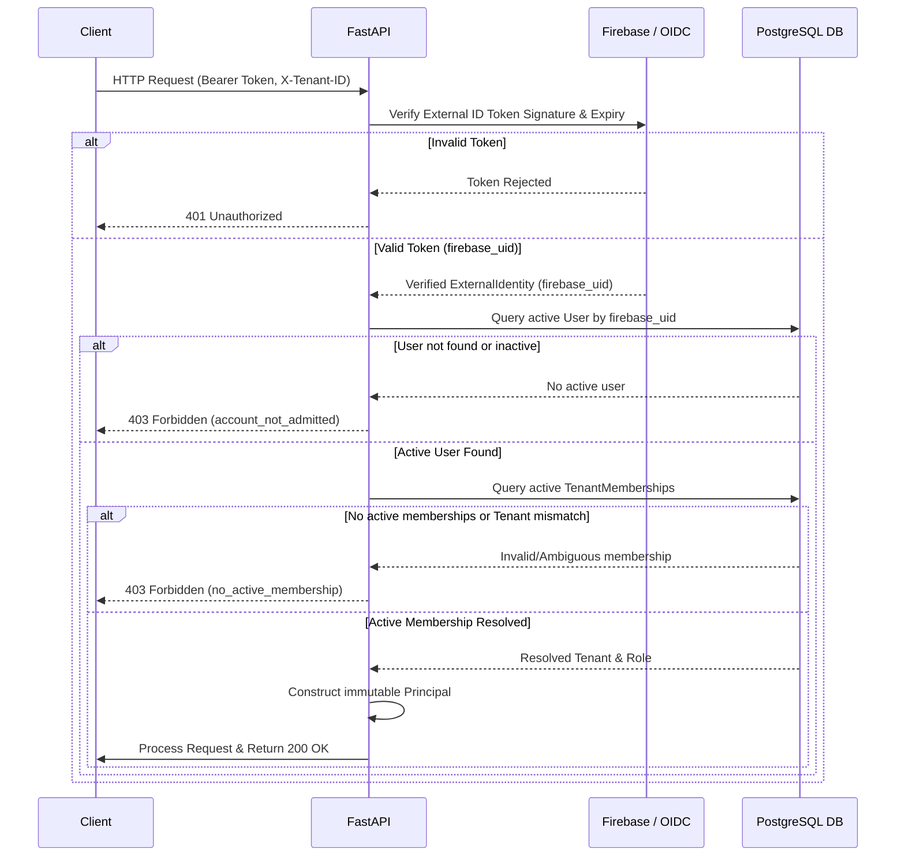

# Ephemeral Engine Security and Authorization Model (Phase 1)

## Overview
This document defines the application security and authorization foundation implemented in Phase 1 of the Authentication Gateway.

The system enforces a strict boundary between:
1. **External Identity Verification**: Performed by identity provider adapters (Firebase Admin SDK or OIDC JWT verifiers).
2. **PostgreSQL Identity & Membership Resolution**: Authoritative resolution of application users, tenants, tenant memberships, roles, permissions, and session ownership.
3. **Internal Principal Construction**: Immutable internal `Principal` constructed only after PostgreSQL resolution succeeds.
4. **Tenant Isolation & Resource Authorization**: Mandatory tenant isolation and permission checks across all API operations.

---

## Security Invariants

1. **Immutable External Identifier**: `firebase_uid` is the sole immutable external subject key mapped to `users.firebase_uid`. Email is never used as an authorization identifier.
2. **Necessity vs Sufficiency**: A verified external ID token is necessary but **insufficient** for application access. An un-provisioned identity or inactive account receives `403 Forbidden`.
3. **No Request-Controlled Trust**: No `tenant_id`, `user_id`, `role`, `scope`, or ownership field from request bodies, parameters, or unverified JWT claims is trusted.
4. **Tenant Selection Rule**:
   - Single Active Tenant: Automatically resolved if the user has exactly **1** active tenant membership.
   - Multiple Active Tenants: The caller must explicitly supply a valid `X-Tenant-ID` header matching an active membership. Missing or mismatched headers fail closed with `403 Forbidden`.
   - The fallback mapping of `tenant_id = subject` is completely removed.
5. **Fail-Closed Production Safety**: Application mode `AUTH_MODE=disabled` in `production` environment mode will cause application startup to fail immediately.
6. **Audit Sanitization**: Security logs record sanitized request IDs, user IDs, tenant IDs, actions, and outcome reason codes. Raw tokens, authorization headers, credentials, prompts, or model outputs are strictly excluded.

---

## PostgreSQL Authoritative Schema

### `users`
- `id`: UUID Primary Key
- `firebase_uid`: Unique, indexed string key
- `email`: User email (display/audit)
- `display_name`: Optional display name
- `status`: `'active'` | `'suspended'` | `'inactive'`
- `created_at`, `updated_at`, `last_login_at`

### `tenants`
- `id`: UUID Primary Key
- `identifier`: Unique tenant slug/identifier
- `name`: Organization display name
- `status`: `'active'` | `'suspended'` | `'inactive'`
- `created_at`, `updated_at`

### `tenant_memberships`
- `id`: UUID Primary Key
- `user_id`: Foreign key -> `users.id`
- `tenant_id`: Foreign key -> `tenants.id`
- `role`: `'viewer'` | `'operator'` | `'admin'`
- `status`: `'active'` | `'suspended'` | `'inactive'`
- Unique constraint on `(user_id, tenant_id)`

### `sessions`
- `id`: String Primary Key (session_id)
- `tenant_id`: Foreign key -> `tenants.id`
- `owner_user_id`: Foreign key -> `users.id`
- `status`: `'active'` | `'burned'` | `'expired'`
- `created_at`, `updated_at`, `burned_at`

---

## Role-to-Permission Matrix

| Role | Granted Permissions |
| :--- | :--- |
| **`viewer`** | `runtime:read`, `session:list`, `session:read` |
| **`operator`** | `runtime:read`, `session:list`, `session:read`, `session:create`, `session:query`, `request:cancel`, `session:burn` |
| **`admin`** | All `operator` permissions + `membership:read`, `membership:manage` |

---

## Account Admission Flow

